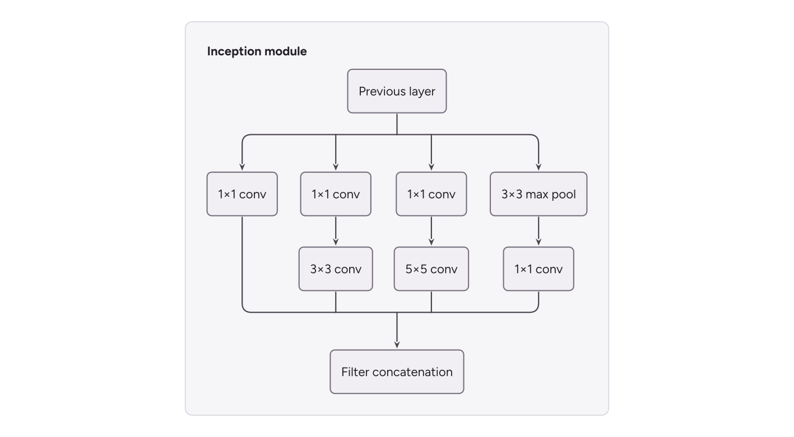
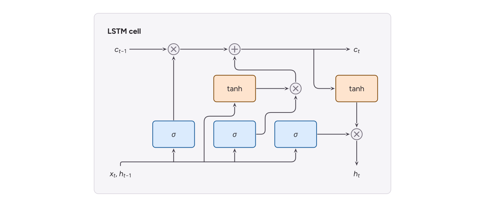
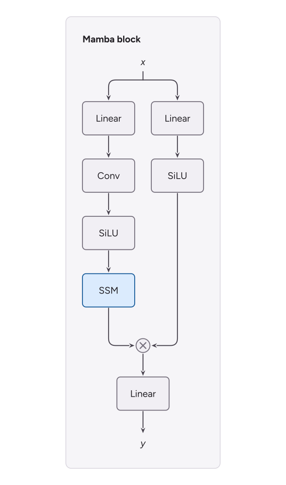
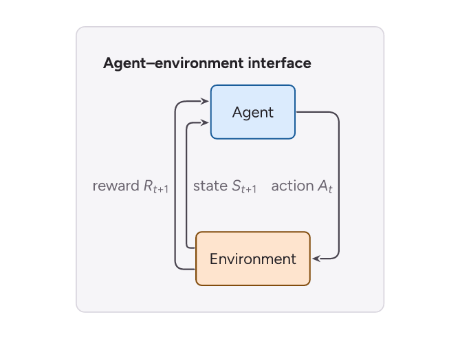
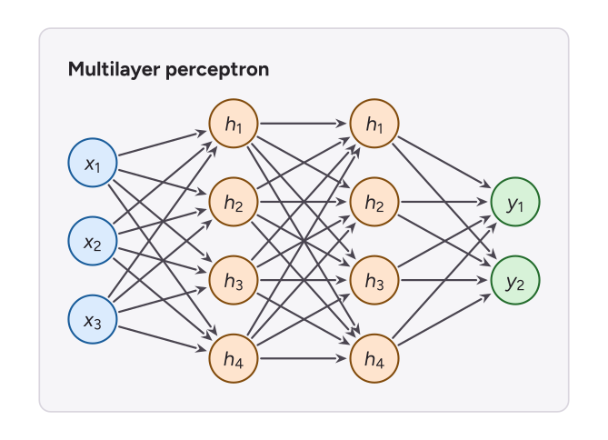
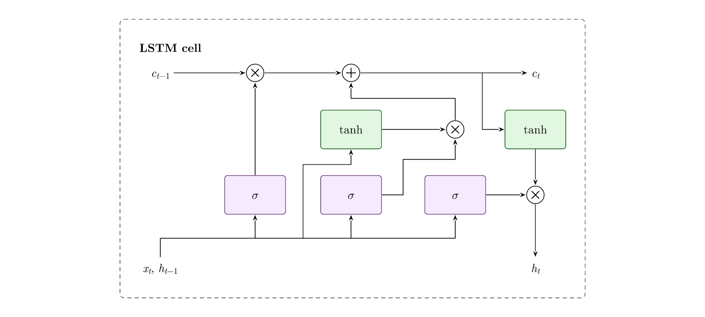

# Flexo

Flexo is a Python-first compiler for editable scientific and neural-network
figures. Authors describe components, relationships, and editorial layout; Flexo
measures text, fits the composition, routes connectors, and emits
publication-ready SVG made from ordinary Inkscape-editable objects.

```text
semantic figure -> measured figure -> fitted figure -> routed figure -> SVG
```

No coordinates, and no post-hoc nudging: the figure you author is the figure
that compiles, and it compiles the same way every time.


## Quick start

```bash
uv sync --all-groups
```

```python
import flexo

with flexo.Figure("block", width="single-column") as figure:
    with figure.module("residual", label="Residual block", layout="column") as m:
        x = m.block("x", label="x")
        conv = m.block("conv", label="3x3 conv", input=x)
        norm = m.block("bn", label="BatchNorm", input=conv)
        total = m.add("sum", inputs=[norm, x])
        m.block("out", label="ReLU", input=total)

result = flexo.build(figure, "build", formats=("editable", "pdf", "png"))
print(result.summary())
```

That is the whole figure: no coordinates, no port tables, no colours, no
routing hints. `flexo.build` compiles, writes the formats you asked for, and
lints; outputs are written even when the report has errors, so a flawed figure
stays inspectable. Derived formats (`portable`, `pdf`, `png`) need Inkscape;
`editable` never does.

## Figures from the literature

[`examples/literature.py`](examples/literature.py) draws twenty-one figures from
papers and textbooks -- Inception, LSTM, Mamba, ViT, U-Net, a GPT block, the
agent–environment loop, a multilayer perceptron, graphical models, and more --
each in about fifteen lines, with no coordinates, colours, or port tables. See
the [gallery](examples/README.md#literaturepy).

| | | |
| --- | --- | --- |
|  |  |  |
|  |  |  |

## Themes, palettes, and fonts

A **theme** is one name for a whole look -- typeface, line weights, corners,
arrowheads, how a module draws its boundary, and the rules that turn colours
into paint. A **palette** is the colours. They compose: every theme takes every
palette.

```python
flexo.Figure("f", theme="paper")                               # the default
flexo.Figure("f", theme="tikz")                                # a LaTeX/TikZ figure
flexo.Figure("f", theme="dark", palette="Cobalt Citrus")       # slides on navy
flexo.Figure("f", theme="swiss", font="Helvetica")             # any installed font
flexo.Figure("f", palette=["#2a6f97", "#e76f51", "#2a9d8f"])   # your own colours
```

| Theme | Look |
| --- | --- |
| `paper` | Journal default: Figtree, pastel boxes with same-hue outlines, Stealth arrows |
| `tikz` | A TikZ figure in a LaTeX paper: Latin Modern, hairlines, 10% tints, dashed module boxes |
| `slides`, `dark` | Projection scale: 12 pt type, heavier lines, 16:9 widths; `dark` on navy |
| `archive` | A 1970s technical report: cream page, Helvetica, hairlines, one accent, greys |
| `print` | Bertin: ink only, kinds told apart by lightness, never by hue |
| `swiss` | International Typographic Style: red and black, section rules instead of boxes |
| `bauhaus` | Primary colours as solid fills, heavy outlines, capitals |
| `midcentury` | Brick, teal and mustard on warm paper, hard offset shadows |
| `rams`, `economist` | Quiet greys and one signal colour; a news graphic with red section bands |
| `classic` | Flexo's original look, kept exactly |

The themes follow the modes of [labviz](https://github.com/jamaliki/labviz), and
the palettes are design-corner's, the same ones labviz plots with, so a diagram
and the plots beside it read as one figure. `flexo themes` lists them all;
`flexo build figure.yaml --theme tikz --palette "Deep Sea Harvest"` overrides a
figure's own choice from the command line.

**Fonts** resolve by family name, and whatever Flexo measures with is what the
SVG, the PDF and the PNG are drawn in. IBM Plex Sans, Figtree, Liberation Sans
(metric-compatible with Arial and Helvetica) and Latin Modern Roman ship with
Flexo and work everywhere; any installed family works by name, and
`flexo.register_font("path/to/Face.ttf")` (or `FLEXO_FONT_PATH`) adds a file.
Characters a family lacks -- Greek in Figtree, say -- fall back to the next
family that has them, measured in the face that will draw them. Bundled faces
are embedded in the SVG, cut down to the characters the figure uses, so an
editable SVG is tens of kilobytes rather than a megabyte and a half, and export
hands Inkscape the same files, so the PDF never falls back to a substitute
face.

### Colour by kind

Each kind of component takes a colour of its own -- the next palette colour for
each kind a figure uses -- so every attention block is one colour, every
add-norm another, and they match wherever they appear. A plain `block` is
neutral until you give it a tone:

```python
tower.block("ff", label="Feed Forward", tone="ffn")   # every "ffn" block matches
tower.block("lin", label="Linear", tone=3)            # the palette's third colour
tower.attention("mha", tone="neutral")                # take a kind's colour away
```

Tones are paint roles (`tone-1-fill`, `tone-1-stroke`, ...), so `flexo retheme`
recolours a finished SVG without touching its geometry.

### Operators and words

```python
m.add("sum", inputs=[a, b])              # a circle with a plus in it
m.multiply("gate", inputs=[value, gate]) # a circle with a times sign
m.op("pe", "~")                          # a sine: a positional encoding
m.op("z", "Σ", inputs=[mu, sigma])      # any other symbol, set as text
m.text("in", "Inputs")                   # words an arrow can start or end at
```

Each value arriving at an operator gets its own arrow into the circle, on the
side that faces where the value comes from. The symbols `+`, `x`, `-`, `.` and
`~` are drawn as strokes, so they sit exactly in the centre in any typeface.

A value that enters an operator from the side -- a position embedding added to
a stream of tokens -- goes in a row with the operator. The row is aligned on
the operator, so the stream stays straight:

```python
with m.row("pe", role="layout") as row:
    pos = row.text("pos", "Position embedding")
    total = row.add("sum", inputs=[projection, pos])
```

### Math in labels

Text between dollar signs is math, in a small subset of TeX:

```python
m.text("c", "$c_{t-1}$")               # subscript: one character, or {a group}
m.block("attn", label="softmax($QK^T$)V")
m.text("eps", r"$\epsilon \sim N(0, I)$")
m.text("out", r"$\hat{x}$")            # \hat, \bar, \tilde, \dot, \vec
m.block("w", label=r"$W_{\text{out}}$")  # \text{} and \mathrm{} are upright
```

Latin letters in math are italic and digits are upright, as in TeX. `-` is a
minus sign. `\alpha` to `\omega`, `\Gamma` to `\Omega`, and common operators
(`\times`, `\cdot`, `\sim`, `\to`, `\le`, `\sum`, ...) become their
symbols. Spaces are kept as typed. Write `\$` for a literal dollar sign; a
single `$` with no closing partner is also literal. A script cannot contain
another script.

A character that the figure's font does not have is set in the next font of
the fallback stack that does. An accent is kept with its letter: if the
primary font has the accent but cannot position it on that letter, the letter
and the accent are both set in a fallback font that can.

### Conventions: branches, merges, arrivals, and lines

Lines meet in three ways, and papers draw each of them differently. The
defaults are:

- **Branch.** A value read by several components is drawn as one tree that
  forks with a plain T. There is no dot.
- **Merge.** Where two lines join into one (`merge(...)`), the joining line
  ends in an arrowhead that points into the line it joins. A merge of three or
  more lines is a bus: the lines meet it with plain Ts, and the only arrowhead
  is the one into the destination.
- **Arrivals.** Several connectors that end at the same port each get their
  own arrow, spread along the side of the box. They are not joined.

If the lines combine by an operation, author the operation with `add`,
`multiply` or `op`. It is then drawn as a circle, and the arrows point into
it.

Change a convention for a whole figure with `conventions=`, or in YAML with a
`conventions:` mapping on the figure:

```python
flexo.Figure("f", conventions={"branch": "dot"})     # a dot on every fork
flexo.Figure("f", conventions={"merge": "plain"})    # no arrowheads at joins
flexo.Figure("f", conventions={"arrivals": "joined"})  # join before the port
flexo.Figure("f", conventions={"lines": "straight"})     # diagonals, not routes
```

| Convention | Values (default first) |
| --- | --- |
| `branch` | `"plain"`, `"dot"` |
| `merge` | `"auto"`, `"arrow"`, `"plain"`, `"dot"` |
| `arrivals` | `"separate"`, `"joined"` |
| `lines` | `"orthogonal"`, `"straight"` |

A theme can carry its own conventions (`LayoutStyle.conventions`). A net's
`joint="arrow"` or `joint="dot"` overrides the conventions for that one net.

### Captions on connectors

`connect(a, b, label="action $A_t$")` puts a caption beside the line. Captions
are placed after routing. The candidate positions are above and below each
horizontal run and on either side of each vertical run, at the middle and then
further toward either end. A caption takes the first candidate that overlaps no
component, title, other caption, or line, and the least-overlapping one when
none is free. A caption names the value its edge carries, so a captioned
edge always gets its own line, even next to another edge between the same two
ports. If a caption does not fit inside its container, the container is given
the room.

### Node-link figures: circles and straight lines

```python
with flexo.Figure("mlp", conventions={"lines": "straight"}) as figure:
    with figure.module("m", label="Multilayer perceptron") as m:
        with m.column("in", role="layout") as column:
            inputs = [column.circle(f"x{i}", f"$x_{i}$", tone="input") for i in (1, 2, 3)]
        with m.column("hidden", role="layout") as column:
            hidden = [column.circle(f"h{i}", f"$h_{i}$", tone="hidden") for i in (1, 2, 3, 4)]
        m.connect_all(inputs, hidden)
```

`circle` is a labelled circle sized to its label; `shaded=True` fills it grey,
the graphical-model mark for an observed variable. A straight edge is one
segment from outline to outline on the line between the two centres. It is not
routed, so it goes through anything in its way, and lint reports that as
`routing.obstacle.intersection`. Two straight edges between the same pair run
side by side. Choose straight lines for a whole figure with
`conventions={"lines": "straight"}`, or for one edge with
`connect(a, b, shape="straight")`. `connect_all(sources, targets)` connects
every source to every target.

### Feature maps

```python
image = m.volume("input", (3, 224, 224), label="224×224×3")
conv = m.volume("conv1", (64, 112, 112), label="conv1", input=image, tone="conv")
```

`volume` draws a feature map as a box in oblique projection: the front face
is as tall as the map's height, the box as deep as its width, and as thick as
its channel count, each on a log scale so a whole network fits on a page.
`shape` is `(channels, height, width)`, or `(height, width)` for one channel.
The label is set under the box; arrows attach to the box.

### Line styles and arrowheads

```python
m.connect(x, z, line="dashed")                  # or "dotted"
m.connect(top, bottom, arrow="none", label="shared weights")  # undirected
m.connect(a, b, arrow="both")
```

`line=` changes only the stroke. `arrow=` says where the arrowheads go:
`"end"` (the default, at the target), `"none"` for an undirected link, which
then meets both components, or `"both"`. Nets take `line=` too.

### Flowcharts

```python
start = m.terminal("start", label="Start")          # a pill: start or end
step = m.block("step", label="Update weights", input=start)
done = m.decision("done", label="Converged?", input=step)  # a diamond
m.connect(done, start, label="no")
```

A line meets a circle or a diamond only at the middle of a side of its box,
which for a diamond is a corner. Each line gets a corner of its own while
corners last, and the arriving lines choose first. So the "no" of a loop leaves
by a side corner, not by the top corner its input came in by.

### Layout groups

A group with `role="layout"` (the `row` and `column` you nest to arrange
things) draws nothing, and has no padding unless you give it one: the space
between its children and its neighbours is exactly the `gap`. A row of such
columns side by side, not wired to each other, is read as parallel branches:
the columns are aligned at the top. Two rows stacked in a column, with the same
number of children and child *i* of one wired to child *i* of the other (and to
nothing else in the pair), are laid out as one grid, so each child sits over its
partner; the same holds for two columns side by side. If a figure is wider than its page, the
compiler first tries tighter gaps and group padding (down to half), and only
then grows the page, with a `layout.width.grown` warning. (It does not tighten
a figure compiled with an explicit `style=`, which it keeps exactly.)

### How connectors are routed

Routing follows the routers that draw connectors well (libavoid, ELK, yFiles).
It never fails for lack of a path: if a figure is too tight for its
connectors, it is laid out again with the room they need. A hint that cannot
be honoured is reported as a warning, not an error. (A `lane=` or waypoint
that names nothing in the figure is still an error.)

1. **Pins.** Every end of every connection gets its own attachment point
   (a pin), on the side of the box that faces the other end. When one gap
   is at least twice the other, the wider gap decides the side; otherwise the
   component's own default side wins. The branches of one net attach on one
   common side: branches spread left to right are entered from above or
   below, and branches stacked top to bottom from the left or right. Pins on
   one side are ordered by where their lines go; ties put the farthest
   counterpart first, so skip connections nest. Two pins that face each other
   across a gap move to one coordinate, so the arrow between them is straight.
   The pin of a net's shared end stays at the middle of its side.
2. **Search.** Each connection is routed on its own with a bend-aware A* search
   over a grid of the figure's lines. Components, their clearance rings,
   group titles, and containers that the connection does not belong to are
   *priced*, not forbidden, so a route always exists. Connections that share a
   pin are routed together as one tree grown from that pin. An arrow normally
   ends on a straight run of `arrival_clearance`; it may end on as little as
   its head plus one elbow when the longer run would force a jog.
3. **Rip up and reroute.** Every connection is routed again with the others
   in view. Crossing another connector is expensive; sharing its corridor is
   cheap, because the next step spaces shared corridors apart.
4. **Separate.** Lines that share a corridor are ordered so that they cross
   least, and spaced one lane apart by a constraint solver (VPSC). The
   crossbar of a Z and the trunk of a tree sit in the middle of the room they
   have.
5. **Uncross.** If lines still cross, neighbouring pins on the sides those
   lines attach to are swapped one pair at a time. The figure is rerouted and
   separated after each swap, and a swap is kept when it removes crossings.
6. **Room.** A connector or caption that had to leave the container it belongs
   to, or a run pressed between a box and the container's edge, asks that
   container for more room, and the figure is laid out again (up to three
   rounds). A crossing whose route could instead run along the container's top
   or bottom edge is offered a lane there, kept only if it removes the crossing.

## Authoring tour

### Components and wiring

```python
import flexo

with flexo.Figure("attention-flow", width="double-column") as figure:
    with figure.module("encoder", label="Encoder") as module:
        features = module.feature_strip("features", label="Node features")
        distances = module.feature_strip("distances", label="Distances")
        combined = module.concat("concat", inputs=[features, distances])
        projection = module.mlp("projection", input=combined)
        q, v = module.channels("query-value", labels=["Q", "V"], input=projection)
        keys = module.cnn("keys", input=features.branch)
        (k,) = module.channels("key", labels=["K"], input=keys)
        attended = module.attention("attention", q=q, k=k, v=v)
        prediction = module.prediction("prediction", input=attended)
        module.residual(features, prediction, lane="encoder-bottom")
```

Every component factory takes the same wiring keywords, so connecting a node
never depends on which one you reached for. `input=` takes one upstream value and
`inputs=` takes several; both work on `node` itself and on all of `block`,
`circle`, `image`, `inset`, `graph`, `matrix`, `sequence`, `tensor`,
`feature_strip`, `vector`, `channels`, `add_norm`, `mlp`, `cnn`, `prediction`,
and `loss`. One source lands on the component's `input` port; several land on
`input1`, `input2`, … where the component has them and share `input` where it
does not. `attention` reads its inputs by name: `input=x` is self-attention
(`x` feeds the query, key, and value), and `inputs=[x, memory]` is
cross-attention (`x` is the query; `memory` the keys and values). `ports=`
composes with the factories that compute ports of their own — give `mlp` a port
table and yours is used whole, and the sources you passed are wired to the input
ports it declares.

Ids are scoped by the group that owns them, so `module.mlp("head")` inside
`encoder` is `encoder.head`; that is what lets the same component name appear in
every module of a figure.

#### Components you can create before their inputs exist

Wiring at creation is a convenience, never a requirement. **No component needs a
source to be created**, `attention` included: `q`, `k`, and `v` wire straight into
its three ports when they are given, and the ports are there either way.

```python
import flexo

with flexo.Figure("transformer", width="double-column") as figure:
    with figure.module("decoder", layout="column") as decoder:
        cross = decoder.attention("xmha", label="Multi-Head\nAttention")
    with figure.module("encoder", layout="column") as encoder:
        top = encoder.add_norm("an", label="Add & Norm")
    figure.net(src=top, sinks=[cross.k, cross.v], id="cross-kv")
```

A figure is not always written in flow order. A decoder's cross-attention reads
keys and values from an encoder that appears *later* in the source, and a
component that could not exist before its inputs would force the whole tower to be
authored inside out.

#### Attention that grows its own Q, K, V

`vectors=` draws the three values an attention block reads as vector glyphs
underneath it, the way the Transformer paper does — one cell stack per port, each
**centred exactly under the port it feeds**, captioned to one side:

```python
import flexo

QKV = {
    "q": flexo.VectorPreset("#9a6fb8", "1x3"),
    "k": flexo.VectorPreset("#c9853d", "1x3"),
    "v": flexo.VectorPreset("#4f9b8f", "1x3"),
}

with flexo.Figure("grown", width="double-column") as figure:
    with figure.module("encoder", layout="column", gap="14pt") as tower:
        norm = tower.add_norm("an", label="Add & Norm", width="120pt")
        mha = tower.attention(
            "mha", label="Multi-Head\nAttention", width="120pt", vectors=QKV
        )
    figure.root.connect(mha, norm)
```

`vectors=True` takes the palette's own `ramp-q` and `ramp-kv` roles (keys and
values share one, because they are read together). One `VectorPreset` or one ramp
role name paints all three alike, and a `{"q": ..., "k": ..., "v": ...}` mapping
paints each its own way — keyed case-insensitively, so the mapping you named `Q`,
`K`, `V` after the captions goes straight in. `vectors=None`, the default, is the
plain block: nothing about a figure that never asks for glyphs changes.

**The engine does the arithmetic.** Centring a glyph under a port at 0.24 of a
120pt block is the sort of sum that ends up as a magic inter-glyph gap in the
figure that needs it — and then silently wrong the next time the component's port
table moves. Here the block's own port offsets become the reserved column widths
of a one-row grid exactly as wide as the block: a pad, then a lane per port, then
a pad. A glyph centred in its lane *is* centred under its port, so the connector
between them comes out a plain two-point vertical with nothing to route around,
and the corridor above the glyphs is the ordinary edge-aware sibling gap rather
than a number anybody wrote down. The composite needs a `width` for that reason,
and says so if it does not get one.

The handle still speaks for the block — `output` is the attention output — but
`q`, `k` and `v` now answer from the **glyphs**, because that is where a value
entering this attention arrives:

```python
figure.net(src=embedding, sinks=[mha.q, mha.k, mha.v], id="qkv")   # into the glyphs
figure.root.connect(mha, norm)                                     # out of the block
```

Both of a glyph's ports are pinned, and that is the point: north is the drop into
the attention port above it, south is the feed. A value computed off to one side
travels to below its glyph and comes up, rather than entering between two glyphs
— a lane is only as wide as the port spacing it was cut from, so two runs
entering sideways would have to thread the same gap at the same height.

**The caption stands beside its stack**, not under it, and that follows from the
same sentence: the corridor under a glyph is the only approach its feed has, so a
caption parked in it makes every arriving arrow hook around the words. Beside, the
feeds are dead-straight verticals. The room is the lane's own surplus — a lane is
wider than the stack in it — so the caption takes the half-lane it stands in less
one `caption_clearance` of air, the glyph reserves that same room on the stack's
other side as padding, and the whole glyph comes out exactly one lane wide and
symmetric about its cells. The stack therefore keeps the port's x whichever side
the words take, and it is one side for all three: three captions leaning the same
way read as a convention, a mirrored pair around a middle glyph reads as an
accident. A lane too narrow to hold a caption beside the stack (an attention
pinned under about 56pt) puts it back underneath, `arrival_clearance +
caption_clearance` down, so the approach is at least still open.

A standalone `vector()` keeps its caption below, as it always has: it is wired
from the side and has no approach from underneath to protect.

Lanes are filled in **port-offset order**, not in q/k/v order, so an authored
`ports=` that reads the value on the left puts that glyph on the left too — which
is how the paper draws a cross-attention, with the encoder's V and K nearest the
line that feeds them and the decoder's own Q clear of it on the right:

```python
CROSS_PORTS = (
    flexo.PortSpec("v", flexo.Side.SOUTH, 0.24, adaptive=True, auto_side=True),
    flexo.PortSpec("k", flexo.Side.SOUTH, 0.5, adaptive=True, auto_side=True),
    flexo.PortSpec("q", flexo.Side.SOUTH, 0.76, adaptive=True, auto_side=True),
    flexo.PortSpec("output", flexo.Side.NORTH, 0.5, adaptive=True, auto_side=True),
)
```

In a ports-aligned parent the composite answers with the **block**, so a row of
towers lines up on the attention boxes rather than on the glyph row hanging
beneath them — the same principle as a `vector()` answering with its cell stack
rather than with its caption. See
[`examples/transformer.py`](examples/transformer.py) for all three attention
blocks of a Transformer authored this way.

#### Residual blocks name both of their wires

`add_norm` is a residual join, so it has a port for each wire rather than one
`input` doing double duty:

```python
import flexo

with flexo.Figure("residual", width="double-column") as figure:
    with figure.module("m", layout="column", gap="18pt") as module:
        norm = module.add_norm("an", label="Add & Norm")
        sublayer = module.block("ff", label="Feed Forward")
        fork = module.node("fork", "junction")
        module.connect(fork, sublayer)
        module.connect(sublayer, norm)                            # -> an.input
        module.connect(fork.branch, norm, target_port="skip")     # -> an.skip
```

`input` is what the sublayer computed and `skip` is what went round it; `output`
carries the sum onward and `branch` is the same value tapped for the *next*
block's skip. Two values sent into one `input` are drawn as two arrows side by
side on one side of the box (see `arrivals` under
[Conventions](#conventions-branches-merges-arrivals-and-lines)); naming the
second arrival says which is which, and `add_norm(input=..., skip=...)` says it at
the point of creation.
`residual()` prefers a `residual` or `skip` port automatically for the same
reason.

`input` and `output` are auto-sided, so a tower that reads upward gets its spine
on the edges its ink actually uses with no port table written down. `skip` and
`branch` are **pinned east** instead: a residual is a convention, not a per-node
optimisation, and auto-siding sent one tower's bypass up the right margin and its
neighbour's up the left, so a reader who had learnt "the residual is the wire on
the right" had to learn it again per tower. Both stay adaptive — each slides
along the east edge to meet its counterpart — and they take two lanes there,
`skip` low and `branch` high, because a bypass arrives from below the block it
rejoins and leaves for the one above. A pinned bypass routes *outside* the
block, so a content-hugging container needs side padding for its corridor; the
router asks the layout for exactly that much when it is missing (see *How
connectors are routed*). An author who wants a left-handed figure writes
`ports=` and gets it, exactly as an explicit port table has always worked.

#### Ports pick the side they face

A component's default ports carry a side because geometry needs one, and the
grammar can only guess the common case: values enter west and leave east. Figures
are not all read that way, so **every end of every connection is attached on the
side that faces the thing at its other end** -- per connection, not per port. A
column of blocks comes out with south and north attachments, a readout row
hanging under a trunk is entered from above, and a value that goes both down and
sideways leaves from two sides. None of it costs a line of port authoring.

The rules, in full:

- **an authored `PortSpec` is pinned.** Writing the side down is the choice, and
  nothing overrules it. So is a port named by an edge carrying a
  `depart`/`arrive` hint, and the arrival of a `via` route (ink that comes round
  the west arrives from the west).
- **a port whose side *is* the convention is pinned by the grammar.** `add_norm`'s
  `skip` and `branch` are born east and stay east, so a residual reads the same
  way in every tower.
- **ends of one port that leave the same side share one pin** and are drawn as a
  tree from it; pins on one side are ordered by where their lines go, so lines
  leaving one box never cross each other on the way out.
- **an arrival and a departure of different values do not share a side** when
  one of them can face its counterpart from another side too.
- **a side whose straight approach would run into another box is skipped** for
  the next side that faces the counterpart: an arrow needs its approach clear.
- **an operator's inputs each take a side of their own**, so values meeting at
  a `+` arrive from different directions.
- **two pins facing each other across a gap slide to one coordinate** when both
  boxes allow it and the straight line between them is clear, so the arrow is
  exactly straight and still meets each box square.

Ports no edge or net mentions keep the side they were born with; they are
invisible either way. And the choice is the compiler's, not the document's: the
figure serializes with the sides it was written with, and re-compiles to the same
picture.

### Feature values as vector glyphs

A feature value is not a box. `vector()` composes a vertical stack of rounded
cells with its caption below, and returns the cells so arrows attach to the glyph
itself:

```python
import flexo

with flexo.Figure("vectors", width="double-column") as figure:
    with figure.module("m", label="Attention") as module:
        nodes = module.vector("nodes", label="Node features", ramp="ramp-node")
        mlp = module.mlp("mlp", input=nodes)
        q = module.vector("q", label="Q", ramp="ramp-q", input=mlp)
        kv = module.vector("kv", label="K, V", ramp="ramp-kv", columns=2)
        attended = module.vector("attended", label="Attended", ramp="ramp-attended")
        module.merge(sinks=[q, kv], dst=attended, label="softmax(QKᵀ)V")
```

A vector's four ports are its four side centres — west and east on the *middle
cell* — so a run into a vector comes out straight. The caption is a real node, so
routes keep clear of it; the one thing to know is that it sits directly under the
glyph's *south* port, so a route leaving south has to be given room (panel b
sends its prediction path out of `attended.north` for exactly that reason).

The `ramp` is paint only: `ramp-node`, `ramp-embedding`, `ramp-q`, `ramp-kv`,
`ramp-attended`, and `ramp-output` are defined by every palette, so `flexo
retheme` re-colours a figure without moving a coordinate.

When a panel needs its own colours instead, a `VectorPreset` carries one base
colour and a topology written columns-first, and derives the opaque shades of
each column for you:

```python
import flexo

with flexo.Figure("presets", width="double-column") as figure:
    with figure.module("m", label="Attention") as module:
        module.vector("q", label="Q", preset=flexo.VectorPreset("#e2703a", "1x3"))
        module.vector(
            "kv",
            label="K, V",
            preset=flexo.VectorPreset(("#d0568c", "#7fae3f"), "2x3"),
        )
```

A ramp says *ordered*, which is a claim about the data. Real activations are not
ordered, so a preset **shuffles by default**: `order="shuffled"` permutes each
column's shades and the glyph reads as a feature vector. The gradient is the
special case, and it is asked for by name:

```python
import flexo

with flexo.Figure("ordered", width="double-column") as figure:
    with figure.module("m", label="Attention") as module:
        module.vector("q", label="Q", preset=flexo.VectorPreset("#e2703a", "1x3"))
        ramped = flexo.VectorPreset("#e2703a", "1x3", order="ramp")
        module.vector("scale", label="Scale", preset=ramped)
```

The permutation is deterministic: it is drawn from `seed` (default `0`), so one
preset always yields one figure and a rebuild is byte-for-byte the same. Each
column seeds separately, so the columns of one glyph differ from each other
rather than repeating a pattern sideways. A shuffle that came back in ramp order
would silently lie about what it depicts, so it is rejected and redrawn — a
`"shuffled"` glyph of two or more cells never reads as a ramp.

`tint` and `shade` set how far each column's light and dark ends travel from its
base colour — at least `0.0`, below `1.0` (`1.0` would end at pure white or
black, which is no longer a shade of anything). The defaults, `0.6` and `0.35`,
mix the light end further because a tint stays legible against a white canvas
long after an equal shade has gone to mud. On a *dark* panel that is backwards:
around `tint=0.35` keeps the pale cells saturated instead of washing them toward
the page. `shade_ramp(base, count, tint=..., shade=...)` takes the same two.

### Grids, spacing, and alignment

A module whose chains should line up is a `grid`: rows are the chains, and columns
line them up. Cells are addressed, not counted. A child names its cell with
`at=(row, column)`, 0-indexed from the top left; the children that do not name
one keep author order and flow row-major into whatever cells are left. Nothing has
to fill the holes — a short last row, an empty column, or a gap in the middle of a
row costs no nodes at all:

```python
import flexo

with flexo.Figure("grid", width="double-column") as figure:
    with figure.module("m", label="Attention") as outer:
        with outer.grid("attention", columns=7, column_widths={3: flexo.pt(50)}) as grid:
            nodes = grid.vector("nodes", label="Node features", ramp="ramp-node")
            q_mlp = grid.mlp("q-mlp", input=nodes, height="cells:3")
            grid.vector("q", label="Q", ramp="ramp-q", input=q_mlp)
            grid.vector("attended", ramp="ramp-attended", at=(0, 4))
            grid.vector("embedding", label="Embedding", ramp="ramp-embedding", at=(1, 0))
```

Column 3 above holds no child in either row: it is the corridor the attention
arrow runs down, and its formula has to fit above it. `column_widths={index:
length}` reserves a minimum width for a column even when every cell in it is
empty, so the lane needs no width-carrying `spacer` node to prop it open. Row 1
is one cell long and the six cells beside it simply do not exist.

Mixed mode is deterministic: addressed children claim their cells first, then the
unaddressed ones flow into the remainder. A child addressed at (0, 4) pushes no
sibling sideways — the flow steps over that cell when it reaches it. Two children
addressed to the same cell, or a column outside the grid, is an error where it is
written rather than a puzzle in the rendered figure.

#### Spacing that is not square

`gap` spaces siblings on both axes at once, which is the wrong knob whenever a
panel wants vertical air: buying it out of a seven-column grid's gap spreads the
panel six times as far sideways. `row_gap` and `column_gap` override `gap` on one
axis each — a row reads `column_gap`, a column or stack reads `row_gap`, and a
grid reads both. `padding` is one length for all four sides, an `(x, y)` pair, or
a `(top, right, bottom, left)` 4-tuple:

```python
import flexo

with flexo.Figure("spacing", width="double-column") as figure:
    figure.root.group(
        "attention",
        layout="grid",
        columns=7,
        row_gap=flexo.pt(19),
        column_gap=flexo.pt(19),
        padding=(flexo.pt(11.5), flexo.pt(11.5), flexo.pt(32.5), flexo.pt(11.5)),
    )
```

The four sides are what let a panel's sides sit tighter than its top and bottom,
which is usually what a figure wants: captions hang below the bottom row, so the
floor needs more air than the flanks. Every one of these falls back to the value
it refines — `row_gap` to `gap` to the style token, each padding side to
`padding` — so a figure that asks for none of them keeps exactly the geometry it
had.

#### Aligning by port line instead of by box

`align` normally lines up *boxes*: `start`, `center`, `end`, and `stretch` all
ask where a child's rectangle sits across the axis it is not laid out along. That
is the wrong question for a figure made of arrows. A vector's caption is a
sibling node under its cell stack, so the composite's box is half again as tall
as the glyph and its middle is somewhere in the caption; align two of those by
box and their arrows run uphill.

`align="ports"` aligns the line the side ports live on, exactly the way type sits
on a baseline:

```python
import flexo

with flexo.Figure("ports", width="double-column") as figure:
    with figure.module("m", label="Cryo-EM module") as outer:
        with outer.grid("cryo", columns=7, align="ports") as grid:
            rects = grid.inset("rectangles", label="Edge\nrectangles", height="60pt")
            edge_cnn = grid.cnn("edge-cnn", input=rects)
            grid.vector("kv", label="K, V", ramp="ramp-kv", input=edge_cnn)
```

In a **row** each child is placed so its horizontal anchor — the y of its west
and east ports — lands on the row's shared line; in a **column**, so its vertical
anchor — the x of its north and south ports — lands on the column's shared x. A
grid does both, per row and per column. The line is measured like a line of type:
the row's **ascent** is the furthest any child reaches above it, its **descent**
the furthest below, and the row reserves both — so a ports-aligned row can be
*taller* than its tallest child, because two children may hang off the line in
opposite directions.

An anchor propagates up. A plain component answers with its own centre, which is
where the grammar puts a side-centre port. A group answers with its **anchor
child's** line, carried into the group's coordinates: the child named by
`anchor="<child>"`, or failing that the first child that is neither a label nor a
spacer. That default is what makes a captioned vector answer with its cell stack
rather than with cells-plus-caption, so the caption hangs below the shared line
instead of dragging it down. Name one explicitly when the first real child is not
the one the arrows use:

```python
import flexo

with flexo.Figure("anchor", width="double-column") as figure:
    with figure.module("m", label="Panel") as row:
        with row.column("panel", align="center", anchor="body") as panel:
            panel.block("badge", label="fig. 1")
            panel.mlp("body", label="Encoder")
```

Bounding-box alignment remains the default, and nothing about `center` has
changed — reach for `ports` when a figure is chains of components joined by
arrows, and leave it alone when a group is a shelf of unconnected panels.

#### Heights that match a vector stack

A box that should be exactly as tall as a vector's cell stack says so with
`"cells:N"`. For merely lining the *ports* up, reach for `align="ports"` above;
this is for when the matching height is itself the design.
`vector_stack_height(style, cells)` is the same arithmetic in Python:

```python
import flexo

with flexo.Figure("heights", width="double-column") as figure:
    with figure.module("m", label="Attention") as module:
        nodes = module.vector("nodes", label="Node features", ramp="ramp-node")
        module.mlp("q-mlp", input=nodes, height="cells:3")
        module.mlp("k-mlp", height=flexo.vector_stack_height(flexo.STYLES["paper"], 3))
```

Prefer the string. It resolves against the style the figure is *compiled* with,
so a panel drawn at a larger `vector_cell` keeps its boxes and its vectors in
step; a length computed up front does not.

### Band rows and strip bands

Cross-container alignment is authored, not hoped for. When a residual spine runs
beside a stack of modules, make the root a column of **bands**: every band is a
row that starts with the same fixed-width spine cell, and *module bands alternate
with thin strip bands*. A module band carries the module; the strip band between
two modules carries the single spine block that joins them.

```python
import flexo


def band(root, id):
    """One band row, always starting with the spine column."""

    return root.row(id, gap="24pt", padding=0, align="start", role="layout")


layout = flexo.LayoutSpec("column", gap=flexo.pt(20), align="start")
with flexo.Figure("gnn", width="presentation", layout=layout) as figure:
    with band(figure.root, "band1") as module_band:
        previous = module_band.block("previous", label="Previous layer", width="72pt")
        module_band.group("sequence", label="Sequence module", role="module", shadow=True)
    with band(figure.root, "strip1") as strip:
        strip.add_norm("addln1", label="Add LN", width="72pt", input=previous)
```

No port table appears in that sketch. The spine reads downward, so the spine
blocks' `input` and `output` face north and south on their own (see *Ports pick
the side they face*); the one port that has to be named is the `feedback` port a
residual rail arrives on, because that rail is routed through an authored lane and
so has no counterpart to face. A spine block whose bypass arrives from an
authored lane rather than from the block below names its arrival too — the
gallery's `add-norm` puts `skip` on the north, which is a port table overruling
the east-pinned default on purpose.

Why the alternation matters: a spine block level with the *top* of the module it
feeds has no reachable east side, so its feedback rail is forced up and over the
module. Give it its own strip and the same rail reads correctly — east out of the
module's update MLP, south past the module, west along the strip, into the east
feedback port, always below the module. The strip is also where a fan-out net from
the last spine block lands its rail, between that block and the row it feeds
instead of below it.

Three uses of the zero-size `spacer` component hold that grid open without
padding anything:

- a `width`-only spacer in the spine cell of a module band, so every band's
  spine column shares one x;
- a zero-size spacer *after* the module, which carries the band's right edge one
  gutter past it — `lane="<band>-right"` then names an empty column where a
  residual rail can drop south. Inside the module the container fill would paint
  over it.
- a `height`-only spacer row above a row of heads, reserving the fan-out
  corridor in one direction only. A single `padding` would reserve it on all four
  sides and leave a dead strip at the canvas edge.

[`flexo/gallery.py`](src/flexo/gallery.py)'s `modelangelo_gnn` is authored this
way; its canvas ends at the content plus the ordinary margin on every side.

### Nets and rails

Shared values and true combinations are authored explicitly rather than inferred
from coincident lines:

```python
import flexo

with flexo.Figure("nets", width="double-column") as figure:
    with figure.module("m", label="Readout", layout="column") as module:
        trunk = module.add_norm("addln", label="Add LN")
        with module.row("heads", gap="18pt", padding=0, role="layout") as heads:
            first = heads.mlp("first", label="MLP")
            second = heads.mlp("second", label="MLP")
            third = heads.mlp("third", label="MLP")
        average = module.block("average", label="Average")
    figure.net(src=trunk, sinks=[first, second, third])
    figure.merge(sinks=[first, second, third], dst=average, rail="east", label="Average")
```

`net` draws one value going to several places as a tree grown from the source:
a trunk, and branches off it as plain Ts. `merge` draws several values arriving
at one place as a tree grown from the destination; in a merge of two, the one
that joins the other's line ends in an arrowhead pointing into it, and a merge
of three or more is a bus with its one arrow into the destination. Edges that
leave the same port are drawn the same way -- three `connect` calls from one
output are one tree. (Edges that *arrive* at one port stay separate arrows by
default.) Every bend inside a piece of the tree turns on the elbow fillet (6 pt
in `paper`, square in `tikz`, `swiss`, `archive` and `bauhaus`);
set `elbow_radius=pt(0)` on a derived `LayoutStyle` for a sharp
technical-drawing treatment anywhere.

`net` and `merge` are figure-level calls, and also methods on every group builder:
`root.net(...)` works wherever `root.connect(...)` does, with the same arguments
and the same result, so authoring a net never means reaching back out of the block
you are writing.

An unhinted rail sits **in the middle of the free corridor** its stems leave it —
the gap between the hub component's edge and the nearest edge of what it feeds.
Trunk and stems each get half the run, so the rail reads as a corridor the figure
meant to leave rather than as a line drawn against the box its branches come out
of. The exception is a net with a caption and no `rail_at`: the caption is
written above the run, so halving the run would draw the rail through the words.
Its joint goes to the far end of the corridor instead, and the whole run is the
caption's.

A trunk that leaves **along** the axis its rail runs on — an encoder's output
crossing the page into a decoder's cross-attention — draws a Z: a stretch along
the port axis, a crossbar over to the rail, and the rail carrying on the same
way. The crossbar sits in the middle of the free span between the hub's escape
and the first thing in its way, so the two arms are arms of one step rather than
a stub against the box the trunk just left. `rail`, `rail_at` and `via` place the
net themselves, and switch the default off.

Two hints place and mark that joint:

```python
import flexo

with flexo.Figure("joint", width="double-column") as figure:
    with figure.module("m", label="Attention") as module:
        q = module.vector("q", label="Q", ramp="ramp-q")
        kv = module.vector("kv", label="K, V", ramp="ramp-kv", columns=2)
        attended = module.vector("attended", ramp="ramp-attended")
        module.merge(sinks=[q, kv], dst=attended, rail_at=0.55, joint="arrow")
```

`rail_at=0.55` asks for the joint partway along the run -- the fraction is
measured from the source port toward the destination port. It is a request:
where clearances forbid it the router takes the nearest position that fits and
reports `routing.net.rail-at.clamped`, naming the fraction it got, as a lint
warning rather than silently obeying or failing. `joint="arrow"` puts an
arrowhead on every joining branch, even in a bus; `joint="dot"` marks the joints
with dots instead, whatever the figure's conventions say.

#### Single-jog routes cross in the middle

Two ports that do not line up give a **Z**: a run out of the source, one crossbar,
and a run into the target the same way. Any coordinate in the span between the two
ports' clearance boundaries draws that shape with the same length and the same one
elbow, so the search has no reason to prefer one — and picking whichever it reached
first leaves the crossbar against an endpoint, which reads as an L with a kink in
it rather than as a step across. The default is the **midpoint of the free span**:
the stretch between those two clearance boundaries, less anything an obstacle
standing across the crossbar takes out of it.

A **C** — a route whose two arms double back over each other, wrapping a module or
running up a margin — keeps its corridor. Its arms share no span to be centred in,
and the corridor it took was chosen against the whole figure rather than between
two ports. So does any route the author aimed with `lane=` or a waypoint, and any
pair of parallel jogs a lane apart: balancing never overrides a hint, and
never pulls two crossings onto one coordinate.

#### `via=`: which side a route should keep to

A route that has to leave the straight line between its endpoints has two ways
round whatever stands in the way, and the router cannot see which one *reads*. A
connector that wraps the far face of a tower comes back through it; the same
connector taken round the near side stays in the margin. `via=` is one word for
which margin:

```python
root.connect(source, target, via="west")
figure.net(src=encoder_top, sinks=[cross.k, cross.v], via="west")
figure.merge(sinks=[first, second], dst=average, via="south")
```

It takes a `Side` or a side name on `connect`, `residual`, `net`, and `merge`, and
defaults to no hint at all. Three things follow from it:

- **the route pays for the corridor it refused.** Length spent beyond the span
  of its pins, on the side opposite the hint, costs `OFF_SIDE_COST` per point
  (`flexo.routing.router`) -- enough that the near corridor wins wherever it
  exists, little enough that the far one is still available when it is the only
  one. Inside the span nothing is priced: every route has to cross it.
- **a net leans the same way.** `rail=` and `via=` on a net both price the far
  side. `rail=` also moves the trunk to the hinted edge of its corridor; a `via`
  trunk stays centred in the corridor it gets. The two may not be combined, and
  `via=` may not be combined with `rail_at=`.
- **the ends face the hint.** Ink that comes round the west arrives from the
  west, so an auto-sided target port takes that side (an authored `PortSpec` or a
  `depart`/`arrive` hint still wins, for edges and nets alike). The source takes it too when the hint is
  across the line of travel: an edge to the box above, kept west, leaves west and
  comes back in a C -- the drawing of a feedback loop. When the hint lies along
  the line of travel, the source keeps its own side, because leaving toward the
  hint would mean leaving backwards.

Like `rail_at`, it is a request. Where the geometry leaves no corridor on that
side the router takes the nearest one and reports it —
`routing.via.clamped` for an edge, naming the side it actually achieved, rather
than failing or silently obeying. (A net's `via` is not checked this way.)

A net's caption -- a formula such as `softmax(QKᵀ)V` -- sits above the
horizontal run its arrow draws, `caption_clearance` above the run's ink measured
from the bottom of the caption's own descender box (a subscript makes that box
deeper than the font's descender). A riser out of the middle of the run cuts it
in two, and the caption takes the wider stretch that is left. An edge's caption
is placed as described in [Captions on connectors](#captions-on-connectors).

Attention then reads as a formula rather than as a matrix: the merge carries its
caption in styled runs (`TextRun("T", baseline_shift="super")`) and Flexo anchors
it above the horizontal run the arrow draws.

### Paint: palettes, overrides, and retheming

A theme (see *Themes, palettes, and fonts*) is the usual way to change a whole
look. Underneath, every shape is painted by **role** -- `ink`, `container-fill`,
`tone-2-stroke` -- so a palette can also be adjusted role by role, and it moves
no geometry:

```python
import flexo

paint = flexo.resolve_palette("paper").with_overrides(
    {"container-fill": "#fbfaf7", "connector": "#5b5b5b"}
)
with flexo.Figure("adjusted", width="double-column") as figure:
    with figure.module("m", label="Attention") as module:
        module.mlp("q-mlp", label="MLP")

document = figure.compile(palette=paint).document
```

An unknown role is a diagnostic listing the valid ones, so a typo cannot silently
paint nothing. The pre-theme palette objects (`DEFAULT_PALETTE`,
`COLOR_VISION_SAFE_PALETTE`, `GRAYSCALE_PALETTE`) still work, and their names read
as colour sets under any theme. `flexo retheme` re-paints a *finished* SVG by
role, with no recompile -- which is what the `data-flexo-fill` and
`data-flexo-stroke` attributes on every emitted shape are for:

```bash
uv run flexo retheme build/fig.editable.svg "Okabe-Ito" --theme paper -o build/fig.cvd.svg
```

When exactly one component or module must differ — a caption that has to clear its
own dark body, say — `paint` overrides the role for that one entity:

```python
import flexo

with flexo.Figure("painted", width="double-column") as figure:
    with figure.module("m", label="Attention", paint={"fill": "#0d2b26"}) as module:
        module.mlp("q-mlp", label="MLP", paint={"label": "#9fe1cb"})
        module.block("panel", label="Panel", paint={"fill": "#085041", "stroke": "#56bb9a"})
```

The three parts are `fill` and `stroke` (the component or container body) and
`label` (its text or title); any other key is an error where it is written, as is
a colour that is not `#rgb` or `#rrggbb`. Parts left out keep their role and
retheme normally. `paint` is paint: it moves nothing, on a group or a node.

Three kinds of ink are **literal colour rather than a role**, and `flexo retheme`
walks straight past all three: `VectorPreset` cells, any `paint=` override, and an
`image`'s embedded artwork. Reach for a preset or an override when one panel has
to differ; change the palette when every component of a kind does.

#### Titles and motifs

A group's title sits at the left of its top edge unless it asks otherwise, and
component motifs — the MLP's three dots, the CNN's zigzag, a matrix's cell grid —
are ornament that `motif=False` drops:

```python
import flexo

with flexo.Figure("ornament", width="double-column") as figure:
    with figure.root.group("attention", label="Attention module", title_side="right") as module:
        module.mlp("q-mlp", label="MLP", motif=False)
```

`title_side="right"` anchors the title to the right end instead. The title band is
the same height either way, so nothing in the figure moves. A title takes styled
runs like any other label — `label=(TextRun("QK"), TextRun("T",
baseline_shift="super"))` — and is set at the style's `title_weight`, which a run
inherits unless it asks for a weight of its own; and `motif=False`
changes nothing else either — same size, same body, same ports, same label. Reach
for it when a panel repeats a component often enough that its ornament becomes
noise.

A motif that sits *below* the words rather than behind them — `inset`, `graph`,
`matrix`, `attention`, `sequence`, `concat`, `feature-strip` — stacks the two: the
label takes a band at the top, `motif_label_gap` of air comes off after it, and
the motif gets the rest of the interior. One band model, so a component's
intrinsic height, its label's baseline, and the area its motif paints in are the
same three numbers everywhere; a two-line caption makes the box taller instead of
being drawn over the drawing it names. An authored `height` still wins, and when
it leaves less room than the illustration wants, an `inset` scales its molecule
down to fit rather than colliding with the words.

An add-norm carries no motif: the words are the component. A circled plus before
`Add LN` says a second time what the label already says, and in a figure with an
Add/LN on every band it reads as clutter.

### Artwork you drew yourself

Some ink is not the compiler's to invent — a molecule, a density-map view, the one
panel that has to be the real thing. Draw it as an `.svg` (or render it to a
`.png`) and hand Flexo the file:

```python
import flexo

with flexo.Figure("artwork", width="double-column") as figure:
    with figure.module("m", label="Ligand") as panel:
        # Paths to your own files: an SVG stays vector, a PNG is embedded.
        ligand = panel.image("ligand", "art/ligand.svg", width="96pt")
        panel.image("map", "art/density.png", height="cells:3", label="Density")
        encoder = panel.mlp("encoder", label="Encoder")
        panel.connect(ligand, encoder)
```

An `image` is an ordinary component with the four side-centre ports, so it wires,
lays out, and blocks routes exactly as a block does. An SVG source stays vector
the whole way: Flexo nests the file's own content at the node's bounds with its
viewBox intact, so the drawing is crisp at any zoom, still made of objects an
editor can select, and comes out as vector art in the PDF too. Artwork is
**embedded, not linked** — the editable SVG, the portable SVG, and the PDF each
carry it, with no companion file to lose.

Size follows the file. Its intrinsic size comes from its `width` and `height`, or
from its viewBox read as CSS pixels; a PNG's comes from its pixel size at 96 dpi.
Give `width` or `height` alone and the other follows the artwork's aspect ratio;
give both and the drawing letterboxes inside those bounds rather than distorting.
Both take any length or `"cells:N"`, so a row of icons can be exactly as tall as
the vector stack beside it. A file that declares no size at all has to be given
one. The path resolves against the working directory the figure is *compiled* in,
so absolute paths are the reliable choice; a missing file, an unreadable one, or a
suffix that is neither `.svg` nor `.png` is a diagnostic naming the node and the
path.

Artwork is checked before it is inlined, because inlining is what would make it
dangerous. A file carrying a `<script>` element, an `on*` event handler, or a
reference to anything outside itself — an `href` to `https://…` or to a
neighbouring file, a `url(…)` that is not a `#fragment`, a stylesheet `@import` —
is **rejected with a diagnostic**, not quietly stripped: a drawing that would not
survive embedding intact is one you want to hear about while you can still
re-export it. The XML declaration, the DOCTYPE, and comments never travel. Every
id in the artwork is rewritten under the node's id, so the same file may be
embedded twice in one figure without the two copies sharing a gradient.

A `label` **takes a band off the top and the artwork takes the rest**, exactly as
it does on an `inset` or a `matrix`: the words name the drawing, so they are never
printed across it. An authored extent is the box, which means `height="40pt"` on a
captioned image shrinks the *drawing* — the caption's line is the one size in
there the author did not choose. An image with no label reserves nothing and comes
out exactly as large as the file it carries. For a caption that hangs *under* the
drawing instead, put the image and a `label` node in a column, the way `vector`
captions its stack.

### Shadows

`shadow=True` gives a group or a node a soft drop shadow, and it is off everywhere
until asked for:

```python
import flexo

with flexo.Figure("shadowed", width="double-column") as figure:
    with figure.root.group("cryo", label="Cryo-EM module", role="module", shadow=True) as module:
        module.mlp("q-mlp", label="MLP", shadow=True)
```

It is built from nested rounded rectangles, not from an SVG filter, and that is
not an implementation detail to be tidied away later: Flexo's figures leave as
editable SVG and arrive as PDF through Inkscape, which does not know
`feDropShadow` at all and turns any `feGaussianBlur` subtree into a 96 dpi bitmap.
Either would put a raster patch behind every shadowed box in an otherwise fully
vector figure. Five equally faint rectangles, each reaching a fifth less far than
the last and all offset together down and to the right of the box, grade to
`shadow_opacity` where they overlap and stay selectable objects all the way to
print.

The figure is lit from the top left, so a shadow shows along the **bottom and
right** edges and nowhere else — a shadow that rings all four is a halo, not
light. That is geometry rather than clipping: with `shadow_offset` at least
`shadow_spread`, the widest layer's top-left corner lands on the box's own
top-left corner and every tighter layer starts further in, so no layer can put ink
above the top edge or left of the left edge at any corner radius. A smaller offset
is raised to the spread rather than drawn. `shadow_offset`, `shadow_spread`, and
`shadow_opacity` tune it; the `shadow` palette role paints it, so `flexo retheme`
moves it with everything else.

### Export formats

```python
import flexo
from flexo.gallery import vertical_slice

result = flexo.build(
    vertical_slice(),
    "build",
    stem="slice",
    formats=("editable", "png"),
    dpi=300.0,
)
print(result.report.format())
```

| Format | What it is |
| --- | --- |
| `editable` | the SVG master: live text, named Inkscape layers, paint roles on every shape. Always written |
| `portable` | the same figure as plain SVG, for viewers that do not know Inkscape's namespace |
| `pdf` | vector PDF for submission |
| `png` | a raster preview at `dpi` |

Everything but `editable` is produced from it by Inkscape, which must be on
`PATH`, in the standard macOS application location, or named by `FLEXO_INKSCAPE`.

## Which role paints what

An author overriding a palette needs to know which role reaches which ink before
writing the override, not after grepping the renderer.

| Role | Paints |
| --- | --- |
| `canvas` | the page background; the ring around a `junction` dot |
| `ink` | component labels, group titles, `channels` captions |
| `muted-ink` | connector and net captions, glyph captions |
| `container-fill` / `container-stroke` | a group's container (or its rule or band, by theme); `sequence` body; `concat` body fill |
| `tone-N-fill` / `tone-N-stroke` / `tone-N-ink` / `tone-N-motif` | a component in tone `N`: body, outline, label, and motif ink (dots, zigzags, cell grids). Kinds take tones in the order the figure uses them (attention, add-norm, MLP, CNN, data strips, outputs), and `tone=` gives any component one |
| `block-fill` / `block-stroke` / `block-motif` | an untoned `block`, `tensor`, `concat`, `op` |
| `accent-*`, `warm-*` | the first two tones, under their pre-theme names |
| `inset-fill` / `inset-stroke` | `graph` and `inset` bodies and borders |
| `connector` | edge shafts, net pieces, flow arrowheads, junction dots, the `junction` component's body, the `channels` split path |
| `residual` | the same ink for anything authored `role="residual"`, arrowheads included |
| `ramp-node`, `ramp-embedding`, `ramp-q`, `ramp-kv`, `ramp-attended`, `ramp-output` | `vector` cells -- one role per glyph, fill and stroke, graded by `fill-opacity` |
| `shadow` | a `shadow=True` drop shadow (soft layers, or one slab in `midcentury`) |
| `grid` | defined by every palette, painted by nothing today |

## Command line

```bash
uv run flexo build examples/vertical_slice.yaml --output examples/build
uv run flexo build examples/vertical_slice.yaml --theme tikz --palette "Okabe-Ito"
uv run flexo build examples/vertical_slice.yaml --font "Helvetica"
uv run flexo check examples/vertical_slice.yaml
uv run flexo inspect examples/vertical_slice.yaml
uv run flexo gallery --output examples/build
uv run flexo themes                      # themes, palettes, and bundled fonts
uv run flexo retheme build/slice.editable.svg "Deep Sea Harvest" -o build/slice.recoloured.svg
uv run flexo schema
```

The builder lowers to the same validated, versioned schema that YAML and JSON
parse into, so a figure is one thing written two ways -- see
[`examples/vertical_slice.py`](examples/vertical_slice.py) and its
[YAML equivalent](examples/vertical_slice.yaml). A figure's `style` (its theme),
`palette` and `font` are fields of that document too.

`build` and `gallery` always write their outputs so a flawed figure stays
inspectable: lint diagnostics go to stderr and the command exits `1` when any of
them is an error. Only a hard compile failure (exit `2`) produces no output.

## Development

```bash
uv sync --all-groups
uv run pytest
uv run ruff check
uv run flexo --help
```

See [the architecture](docs/architecture.md), [the implementation report](docs/implementation-report.md),
and [the improvement beam](docs/improvement-beam.md).

## Design principles

- semantic authoring instead of routine SVG coordinates;
- immutable, deterministic compiler passes;
- physical publication dimensions and measured typography;
- stable semantic IDs, named ports, and localized diagnostics;
- connectors routed as a whole, never failing: pins on the facing side, trees for
  shared values, crossings priced, lanes solved, and room asked of the layout;
- first-class fan-out nets and merges: branches are plain Ts, a merge of two ends
  in an arrow, and an operation is an operator node;
- defaults that read the figure they are in, and authored values that always win;
- orthogonal routing with a theme-controlled local elbow radius;
- themes that change the whole look -- type, line work, colour rules -- and move
  nothing a reader relies on;
- connector ink painted after the components it joins, so no run is interrupted
  by a container fill;
- native SVG primitives, live text, and named Inkscape layers;
- explicit editorial layout with bounded local automation;
- linting that reads the finished figure and never feeds back into it.

The repository is public but does not yet declare an open-source license.
