# Flexo

Flexo is a Python-first compiler for editable scientific and neural-network
figures. Authors describe components, relationships, and editorial layout; Flexo
measures text, fits the composition, routes connectors, and emits
publication-ready SVG made from ordinary Inkscape-editable objects.

```text
semantic figure -> measured figure -> fitted figure -> routed figure -> SVG
```

No coordinates, and no post-hoc nudging: the figure you author is the figure
that compiles, and it compiles the same way every time.

| `theme="paper"` | `theme="sketch"` |
| --- | --- |
| 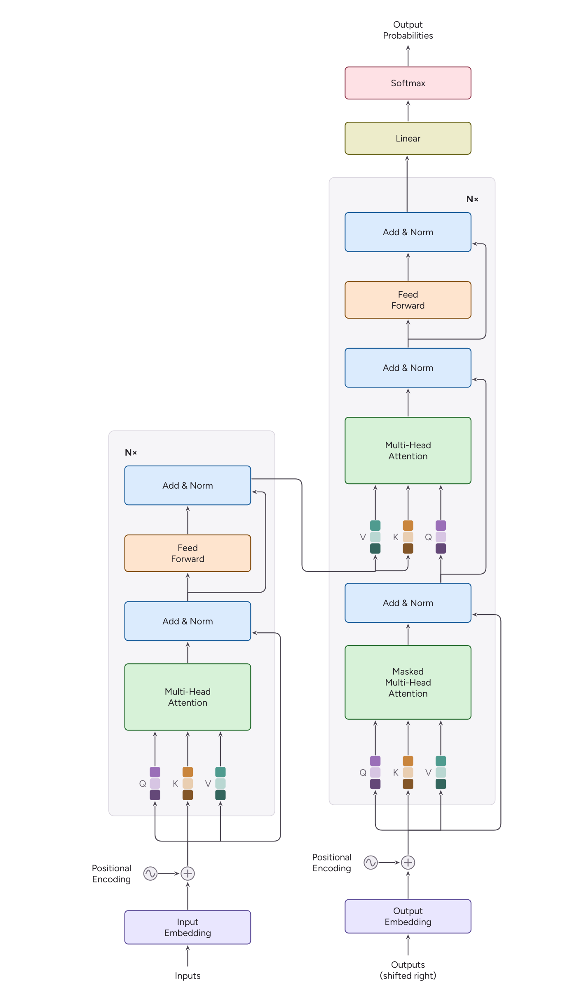 | 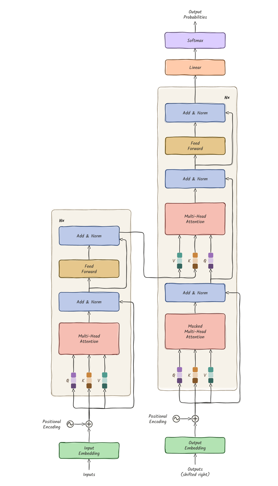 |

New to Flexo? The [tutorial](docs/tutorial.md) builds figures step by step,
from a first box to a themed, hand-drawn panel, with every picture made from
the code beside it.

## Quick start

```bash
uv sync --all-groups
```

```python
import flexo

with flexo.Figure("block", width="single-column") as figure:
    with figure.module("residual", label="Residual block", layout="column") as m:
        x = m.block("x", label="x")
        conv = m.block("conv", label="3x3 conv", input=x)
        norm = m.block("bn", label="BatchNorm", input=conv)
        total = m.add("sum", inputs=[norm, x])
        m.block("out", label="ReLU", input=total)

result = flexo.build(figure, "build", formats=("editable", "pdf", "png"))
print(result.summary())
```

That is the whole figure: no coordinates, no port tables, no colours, no
routing hints. `flexo.build` compiles, writes the formats you asked for, and
lints; outputs are written even when the report has errors, so a flawed figure
stays inspectable. Every format is written in Python, with nothing else to
install: the editable SVG (live text), a portable SVG (words as outlines), a PDF
(real, selectable text in embedded fonts), and a PNG preview. In a Jupyter
notebook, a figure displays itself: end a cell with `figure`.

Components can also be written flat, in any order, and laid out from their
wiring alone:

```python
with flexo.Figure("heads", layout="flow") as figure:
    x = figure.root.text("x", "Input $x$")
    shared = figure.root.block("shared", label="Shared encoder", input=x)
    heads = [figure.root.block(name, label=name, input=shared) for name in ("Depth", "Normals")]
    figure.root.add("total", inputs=heads)
```

## Figures from the literature

[`examples/literature.py`](examples/literature.py) draws sixty-nine figures from
papers and textbooks -- Inception, LSTM, Mamba, ViT, U-Net, a GPT block, the
agent–environment loop, a multilayer perceptron, graphical models, and more --
each in about fifteen lines, with no coordinates, colours, or port tables. See
the [gallery](examples/README.md#literaturepy).

| | | |
| --- | --- | --- |
| 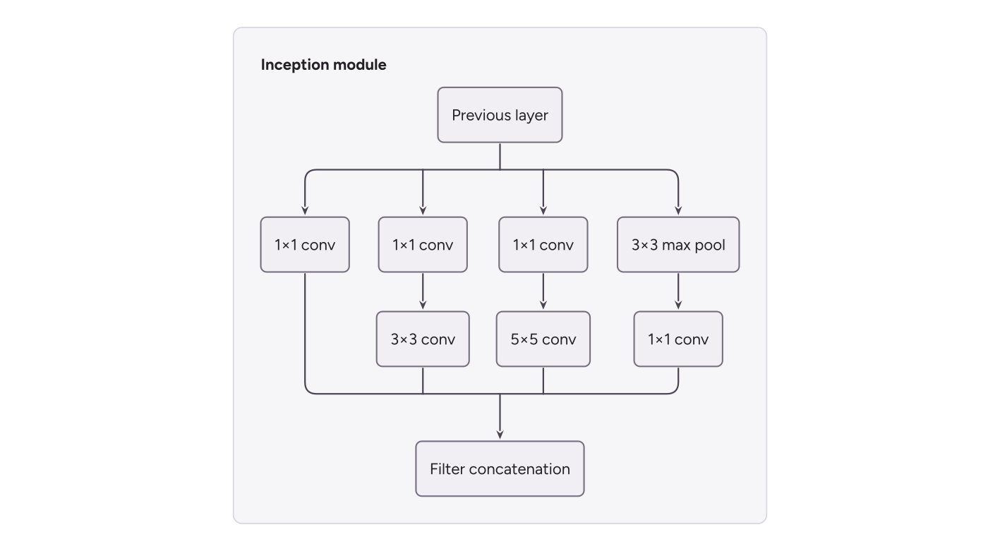 | 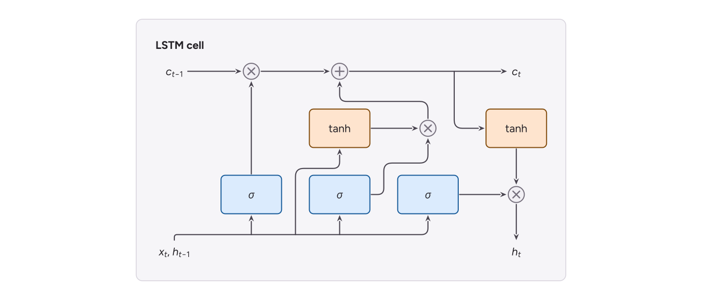 | 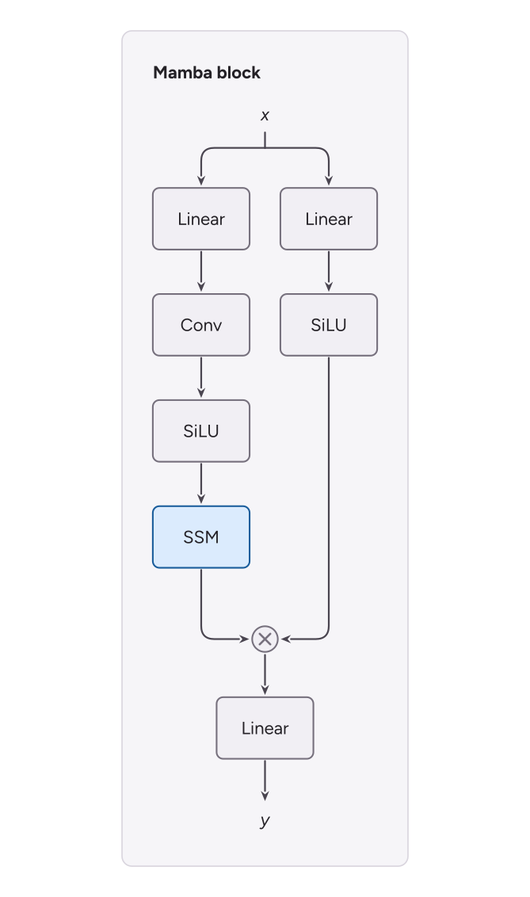 |
| 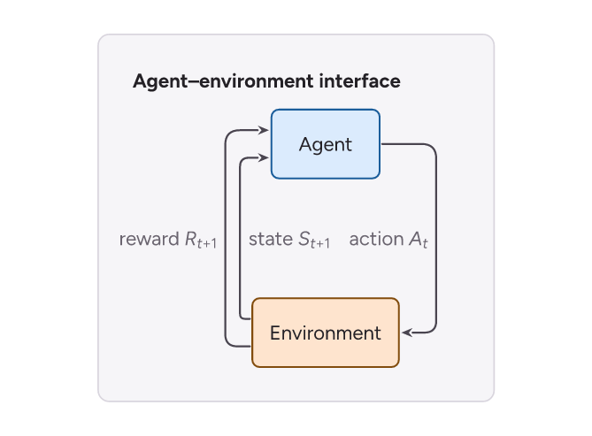 | 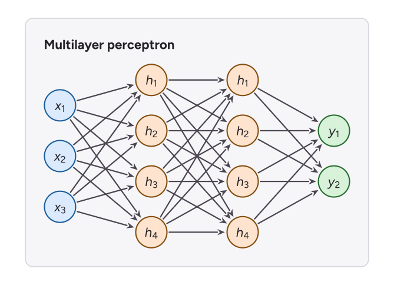 | 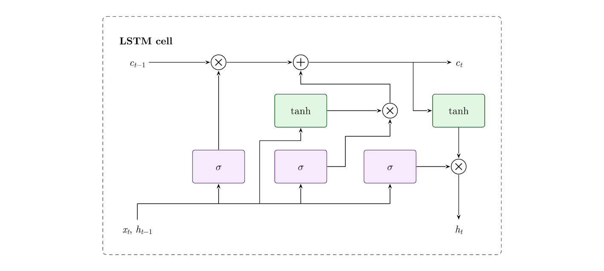 |

## What you can draw

### Components and wiring

A figure is groups of components. `figure.module(...)` opens a titled
container; inside any group, `row`, `column`, and `grid` arrange their children
and, unless given a label, draw nothing. Every component is a method on the group it goes in:

| Kind | Methods |
| --- | --- |
| Boxes | `block`, `mlp`, `cnn`, `attention`, `add_norm`, `prediction`, `loss`, `tensor`, `matrix`, `sequence`, `feature_strip`, `concat`, `channels` |
| Shapes | `circle`, `decision`, `terminal`, `io`, `volume`, `op` (and `add`, `multiply`) |
| Software | `database`, `server`, `cloud`, `queue`, `document`, `person` (see [Flowcharts and architecture diagrams](#flowcharts-and-architecture-diagrams)) |
| Words and art | `text`, `vector`, `image`, `graph`, `inset`, `legend` |
| Genetics | `construct`, `plasmid` (see [Genetic designs](#genetic-designs-constructs-and-plasmids)) |
| Proteins, trees, the bench | `protein`, `tree`, `wellplate`, `timeline` (see [Proteins, trees, plates, and timelines](#proteins-trees-plates-and-timelines)) |
| Grids | `cells`: plate maps, heatmaps, boards, number squares (see [Grids of cells](#grids-of-cells)) |
| Chemistry | `mechanism`: structures from SMILES and the curly arrows between them (see [Reaction mechanisms](#reaction-mechanisms)) |

A label longer than 16 ems wraps into balanced lines, and a component with an
authored `width=` wraps its label to fit; `"\n"` breaks a line where you want.

`input=` connects one upstream component as the new one is created, and
`inputs=` connects several. `connect(a, b)` draws an edge later,
`net(src=a, sinks=[b, c])` draws one value going to several places, and
`merge(sinks=[a, b], dst=c)` draws several values joining before one place.
Edges and nets belong to the figure, not to a group: `figure.connect(a, b)`
and `m.connect(a, b)` are the same edge, so an edge between groups is written
wherever both ends are in hand. The [authoring guide](docs/guide.md) covers
each component and option.

### Genetic designs: constructs and plasmids

A genetic construct is drawn in [SBOL Visual](https://sbolstandard.org/visual-about/)
glyphs on a backbone, and a plasmid as a circular map. Both are components like any
other: they sit in a figure, take its theme (type, palette, hand), and are wired to
other components.

```python
with flexo.Figure("reporter") as figure:
    circuit = figure.root.construct("circuit", label="pTet–GFP reporter", parts=[
        {"type": "promoter", "label": "pTet"},
        {"type": "rbs", "label": "B0034"},
        {"type": "cds", "label": "GFP", "id": "gfp"},   # an id makes the part a port
        {"type": "terminator", "label": "B0015"},
        {"type": "cds", "label": "TetR", "strand": "-"},
    ])
    figure.root.plasmid("vector", 5421, label="pTet-GFP", features=[
        {"type": "promoter", "label": "pTet", "start": 120, "end": 180},
        {"type": "cds", "label": "GFP", "start": 220, "end": 940},
        {"type": "cds", "label": "AmpR", "start": 3300, "end": 4160, "strand": "-"},
        {"type": "origin", "label": "ColE1", "start": 2500, "end": 3090},
        {"type": "site", "label": "EcoRI", "start": 5},
    ])
    protein = figure.root.block("protein", label="Fluorescence", tone="GFP")
    figure.connect(circuit.port("gfp"), protein)
```

| Part | Construct glyph | On a plasmid |
| --- | --- | --- |
| `promoter` | a bent arrow | a short arrow along the circle |
| `rbs` | a half circle on the backbone | -- |
| `cds` (`gene`) | an arrow with the gene's name in it | an arrow arc |
| `terminator` | a T | a T standing out from the circle |
| `operator`, `insulator` | a square; a square in a square | -- |
| `origin` (`ori`) | a circle on the backbone | an arc |
| `primer`, `site`, `region`, `spacer` | a half arrow; a tick; a box; a gap | a thin arrow; a tick named with its position; an arc |

A part on the `-` strand is turned over: it points left and hangs below the
backbone, or runs anticlockwise round the plasmid. A gene takes a colour by its
name, so `GFP` is one colour in every construct and plasmid of a figure, and a
component given `tone="GFP"` matches it; any part can name a `tone` of its own,
and the other parts are drawn in ink. A construct's part with an `id` is a port
under its glyph (`input` and `output` are the backbone's ends), so an arrow can
leave a gene for what it makes. On a plasmid, features are placed by their base
pairs (`start`, `end`; a feature may run across the origin), overlapping features
stack outward, every named feature is labelled outside the circle with a leader
line, and ticks mark every round number of base pairs (`ticks=False` drops them).
`scale=0.1` draws a construct to scale, that many points a base pair: give each
part its length (`"bp": 720`). Genes, regions, and spacers are then as long as
they are, the smaller glyphs keep their size centred on their stretch, the names
sit in one row clear of every glyph and are spread apart where they crowd, and a
base-pair ruler runs underneath (`ticks=False` drops it).
In a figure file the same are `kind: construct` with `properties: {parts: [...]}`
and `kind: plasmid` with `properties: {length: 5421, features: [...]}`.

### Pathways, regulation, and reactions

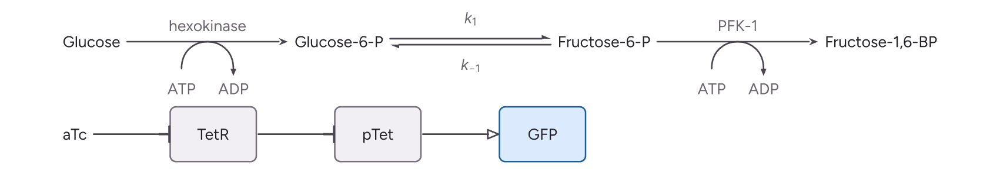

```python
figure.connect(glucose, g6p, label="hexokinase", cofactors=("ATP", "ADP"))
figure.connect(g6p, f6p, arrow="reversible", label="$k_1$", back_label="$k_{-1}$")
figure.connect(tetr, ptet, head="inhibition")      # a repressor on its promoter
figure.connect(ptet, gfp, head="stimulation")
```

`head=` says what a connector does to its target, in
[SBGN](https://sbgn.github.io/)'s arrowheads: `"inhibition"` (a bar, ⊣),
`"catalysis"` (an open circle), `"stimulation"` (an open triangle),
`"necessary"` (a bar and an open triangle), or `"modulation"` (an open
diamond). These heads touch what they act on, where an arrow stops just short.
`arrow="reversible"` draws a reversible step as two half-headed lines (⇌),
with `label` over them and `back_label` under them. `cofactors=("ATP", "ADP")`
writes what a step takes in and gives off as a curved arrow touching the line,
across it from the label; either may be `""` (water taken in, nothing given
off). Layout makes room for both sides of the line, as it does for a caption.
In a figure file these are the edge fields `head`, `arrow: reversible`,
`back_label`, and `cofactors: [ATP, ADP]`.

### Proteins, trees, plates, and timelines

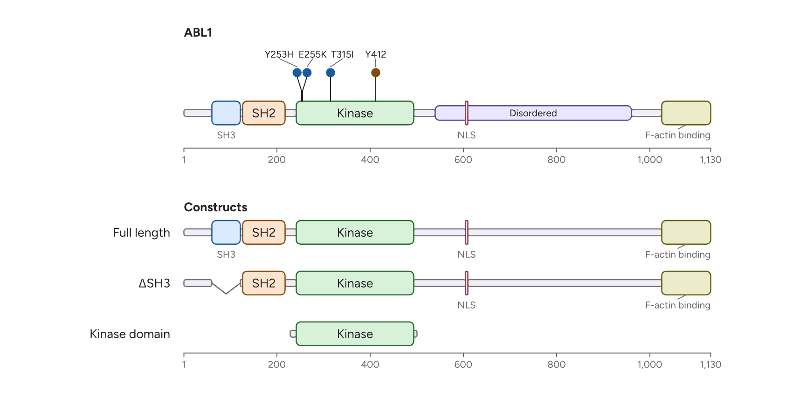

```python
figure.root.protein("abl1", 1130, label="ABL1", features=[
    {"type": "domain", "label": "SH3", "start": 61, "end": 121},
    {"type": "domain", "label": "Kinase", "start": 242, "end": 493},
    {"type": "region", "label": "Disordered", "start": 540, "end": 960},
    {"type": "transmembrane", "start": 1000, "end": 1022},
    {"type": "mutation", "label": "T315I", "at": 315},
    {"type": "phosphorylation", "label": "Y412", "at": 412},
    {"type": "disulfide", "start": 600, "end": 700},
])
figure.root.protein("constructs", 1130, features=domains, tracks=[
    {"label": "Full length"},
    {"label": "ΔSH3", "delete": "61-121"},
    {"label": "Kinase domain", "start": 229, "end": 500},
])
```

`protein` draws a chain to scale by residue: domains, regions, and motifs as
boxes (named inside when the name fits, under the box when not), transmembrane
helices as tall dark bars, a signal peptide as a short box, sites (`mutation`,
`phosphorylation`, `glycosylation`, ... at one residue, `at:`) as lollipops
with their names spread apart, and disulfides as brackets under the chain, over
a residue axis. `tracks` draws the protein several times on one scale -- a
truncation keeps `start` to `end`, a `delete` breaks the chain with a hinge.
A domain takes a colour by its name, as a gene does; every mutation shares one
colour, every kind of modification another. `scale=` (points a residue) and
`gutter=` (room for track names) line up separate proteins. A feature with an
`id` is a port over it; a track with an `id` is a port at each end of its chain
(`"short"` on the left, `"short.end"` on the right), so an arrow can point at one
construct of a stack. Sites closer than their heads are fanned out sideways, each
stem bending from its own residue to a head of its own.

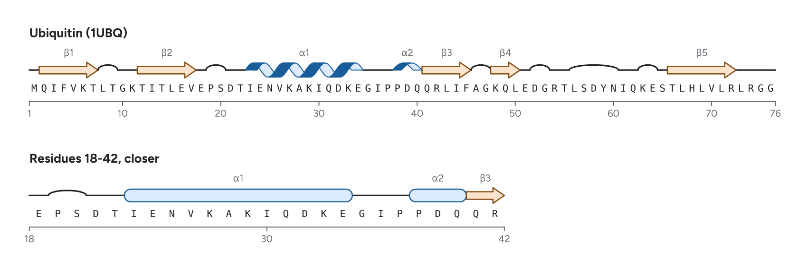

```python
figure.root.protein("ubiquitin", 76, secondary=dssp, sequence=sequence, scale=6.2)
figure.root.protein("close", 76, secondary=dssp, sequence=sequence, scale=12,
                    helix="cylinder", tracks=[{"start": 18, "end": 42}])
```

`secondary=` draws the secondary structure along the chain, on its scale: a
DSSP string, one letter a residue (`H`, `G`, `I` helix; `E` strand; `T` turn;
anything else loop), or features of type `helix`, `strand`, and `turn`.
Helices are ribbons seen side on, the near half of each turn over the darker far
half (`helix="cylinder"` for bars, `"spiral"` for a line), strands arrows, turns low
arches, numbered α1, β1, ... over them (`numbered=False` to leave them bare). The
strip takes the chain's place when nothing else is on it, and runs under the
domains when they are. `sequence=` writes the one-letter sequence under it
wherever the scale leaves room for a letter a residue, and a track's `start`
and `end` make a close view of a segment.

#### From a structure or a UniProt entry

```python
figure.root.protein("ubq", **flexo.from_structure("1ubq.cif"))           # sequence, helices, strands
figure.root.protein("abl1", **flexo.from_uniprot("P00519"))              # domains, motifs, bonds
figure.root.protein("abl1", **flexo.from_uniprot("P00519.json", sites=True, variants=True))
```

`from_structure` reads a PDB or mmCIF file (install the `structures` extra, which
brings [gemmi](https://gemmi.readthedocs.io)): the chain's sequence and its
secondary structure, from the file's helix and sheet records or -- for a model
without them, a design or a prediction, or with `assign=True` -- from the
backbone's hydrogen bonds after DSSP. `from_uniprot` reads an entry from the
UniProt REST service, or a saved entry's JSON: domains, regions, motifs,
transmembrane and signal segments, and disulfides; modified residues and
glycosylations with `sites=True`, variants with `variants=True`, and the entry's
helices and strands with `structure=True`. Each returns the arguments `protein()`
takes, as a plain dict to edit or merge before drawing.

#### A molecule beside its map

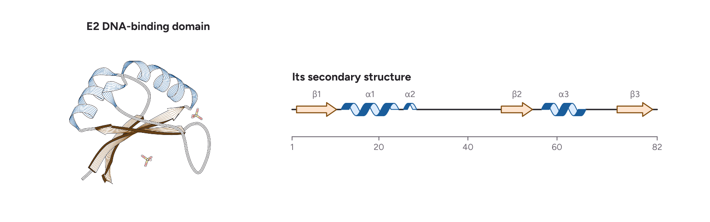

```python
row.structure("model", "1a7g.cif", label="E2 DNA-binding domain", yaw=30, width=150, height=120)
row.protein("map", **flexo.from_structure("1a7g.cif"), scale=3.2)
```

`structure` draws a PDB or mmCIF file (or a PDB ID) by hand with
[mol-sketch](https://github.com/jamaliki/mol-sketch), as a component of the
figure: its look follows the theme (watercolour in `sketch`, dark paper on a dark
page, engraved colour otherwise) unless `look=` names one; it is drawn on the
figure's page colour and that colour taken out, so it sits on the page with no
box; its ink is the figure's, and its helices and strands take the colours a
protein map in the figure gives them. `colors={"A": "Kinase"}` colours a chain
(or a residue, subunit, or entity) with a hex colour or one of the figure's
tones; `yaw`, `pitch`, `roll`, `zoom` turn and frame it; `cartoon`, `sticks`,
`surface`, and `site` are mol-sketch selections (`site="ligand"` picks out the
largest ligand's pocket). The rest of mol-sketch is there too: `palette=` names
one of its group palettes, `density=` draws a density map with the model
(`"auto"`, an EMDB ID, or a map file), and `style=` sets any field of its style
over the look, nested as mol-sketch writes them --
`style={"fill": "ink colour", "line": {"width": 2}}`, or in a figure file
`style: {fill: ink colour, line: {width: 2}}`; a field it does not have, or a
choice it does not offer, is said with what was meant. In the studio, a chosen
structure's panel shows these settings in mol-sketch's own sections, each with
what the look gives it until it is given its own. Install the `molecules` extra
(or `pip install path/to/mol-sketch/python`).

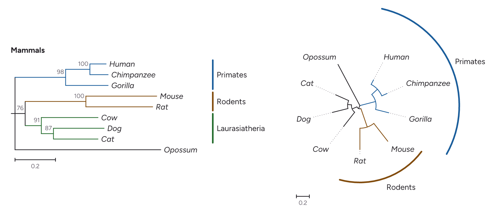

```python
figure.root.tree("mammals", "((Human:0.08,Chimp:0.09)100:0.37,(Mouse:0.35,Rat:0.33):0.3);",
                 support=True, italic=True,
                 clades=[{"tips": "Human, Chimp", "label": "Primates"}])
figure.root.tree("ring", newick, layout="circular")
```

`tree` reads [Newick](https://en.wikipedia.org/wiki/Newick_format): branch
lengths make a phylogram with a scale bar, a tree without them (or
`lengths=False`) a cladogram with its tips lined up. `layout="circular"` puts
the root in the middle, names on the ring. A clade -- the smallest subtree
holding the `tips` named -- is coloured by its name and bracketed beside its
tips; `support=True` writes support values by their nodes.

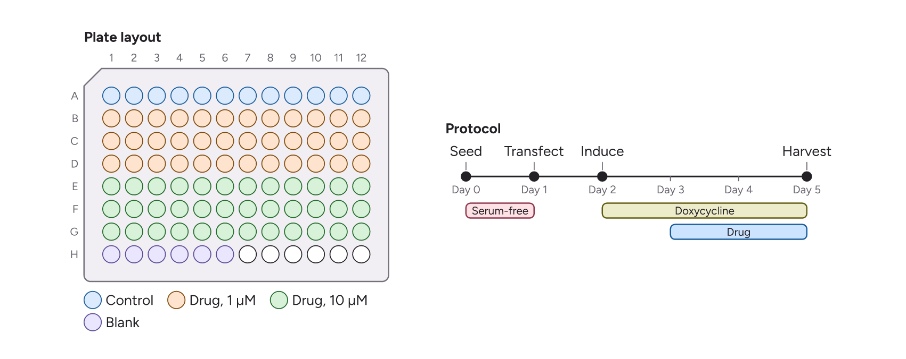

```python
figure.root.wellplate("plate", [
    {"wells": "A1-A12", "label": "Control"},
    {"wells": "B-D", "label": "Drug, 1 µM"},
], wells=96)
figure.root.timeline("protocol", unit="day",
    events=[{"at": 0, "label": "Seed"}, {"at": 2, "label": "Induce"}],
    spans=[{"start": 2, "end": 5, "label": "Doxycycline"}])
```

`wellplate` draws 6, 12, 24, 48, 96, or 384 wells, each group's wells (a well
`A1`, a block `B1-D6`, rows `A-D`, columns `1-3`) filled in its condition's
colour, with a legend. `timeline` sets events as dots on a time axis, named
over it, and spans as bars under it, stacked where they overlap; `unit="day"`
writes "Day 2", `unit="h"` "2 h".

In a figure file each is a node kind -- `protein`, `tree`, `wellplate`,
`timeline` -- with the same names under `properties`.

### Reaction mechanisms

```python
figure.root.mechanism("hydrolysis", [
    {"smiles": "[OH-:5].[CH3:1][C:2](=[O:3])[Cl:4]", "arrows": ["5 -> 2", "2=3 -> 3"],
     "label": "acid chloride", "reagents": "NaOH", "conditions": "H$_2$O"},
    {"arrows": ["3 -> 2", "2-4 -> 4"], "label": "tetrahedral intermediate"},
])
```

A `mechanism` draws structures as chemists draw them and the curly arrows that join
them. Each step is SMILES -- the molecules apart with `.`, the atoms its arrows name
mapped (`[O-:5]`) -- and its arrows: from a lone pair (`"5 -> 2"`: atom 5's pair
makes a bond to 2), from a bond to an atom (`"2=3 -> 3"`: the π bond becomes a lone
pair on 3), a bond moved (`"1=2 -> 2-6"`), a fishhook for one electron (`"~>"`).

The arrows are not decoration: each moves electrons, and the next structure is what
they make -- a step with no SMILES is drawn from them, its atoms where they were, the
attacking molecule brought in beside the atom it bonds to, a leaving group set apart.
A step written out is checked against them. An arrow that cannot be is said in words:
carbon given ten electrons ("as a bond to it forms, another must break"), a lone pair
that is not there, a fishhook left without its partner, a hydrogen with two bonds.
After the last step with arrows comes what they make. With `partial=True` a step that
cannot be is drawn as far as it goes, its arrows on it, instead of refused (as it is
between one arrow and the next while a step is drawn); `flexo.mechanism.mechanism_states`
says what is wrong. In a figure file it is the node kind `mechanism`, its steps under
`properties.steps`, written as in Python: arrows a list or words apart with `;`, a
step's `place` a mapping or words (`"5 move -1 0.5 turn 30"`).

Structures are laid out flat as a chemist would: rings as regular polygons, fused rings
side by side, chains in a horizontal zigzag, every bond on the 30-degree grid, furan
and pyrrole standing on their heteroatom, a double bond keeping the side its SMILES
gives (`F/C=C/F`), a stereocentre drawn with the wedge or hash its `@`/`@@` means. A
cycloaddition is drawn in the shape of its product, so a diene curls s-cis. The
proportions are the ACS document settings: bonds 1.44 label heights long, double
bonds inside their rings, labels clipping the bonds that meet them, hydrogens on the
side the bonds leave free (`OH`, `HO`, `H₂N`), charges circled. Reaction arrows carry
their `reagents` over them and `conditions` under them; `arrow` is `forward`,
`equilibrium`, `resonance` or `none`; steps fold into rows when there are many
(`per_row=`).

The curly arrows are drawn by rule, in one ink: magenta, unless `arrow_colour=` gives
another -- a colour, or the theme's `ink`, `muted` or `accent` (`accent2`...), which
follow the theme.
An arrow carries its electrons: the lone pair (or radical) it starts from is drawn at
its tail, in its ink, out from the atom where its bonds leave room; an arrow from a
bond leaves square to it, a little off its middle. It goes into a bond square to it,
and into an atom along a radius -- on the side with room, facing the electrons, never
back down the bond they leave; a pair re-forming its own atom's double bond curls
from beside the bond down onto it, and two half arrows making a bond meet in its
middle from either side. Of the curves that would do, the smoothest is drawn that
crosses no bond, no other arrow and no charge, and bends one way only; charges move
out of the arrows' way. Other lone pairs are drawn with `lone_pairs="all"`; a radical
is a dot. A step's `place` puts its molecules where you want them, each named by one of
its atoms: `{5: {"move": [-1, 0.5], "turn": 30, "flip": True}}` takes the molecule with
atom 5 a bond left and half a bond down from where it is laid out, turned 30 degrees
clockwise and flipped left for right.

### Grids of cells

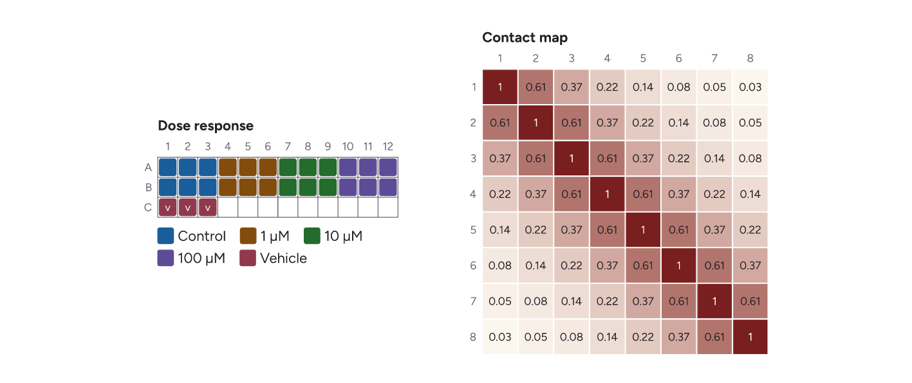

```python
figure.root.cells("plate", """
    C C D1 D1
    C C D2 D2
    V V .  .
""", {"C": {"label": "Control"}, "V": {"label": "Vehicle", "mark": "v"},
      "D1": {"label": "1 µM"}, "D2": {"label": "10 µM"}},
    row_labels="letters", column_labels="numbers", lines="muted")
figure.root.cells("contacts", matrix, ramp=("#fbf6ee", "#7a1f1f"), values=True)
```

`cells` draws a grid written as text, one row per line and one symbol per word
(`.` leaves a cell empty), or given as rows of values. The key says what a
symbol is: a `color` (a tone by name, or an exact `#hex`, painted as written and
left alone by `flexo retheme`), a `mark` written small in the cell, and a
`label` for the legend; a symbol the key does not name takes a tone by its
name. Numbers are values: shaded along `ramp` (two colours, low to high) over
`range`, and written in their cells with `values=True`. `cell` sets a cell's
side in points, `gap` and `corner` how far inside its square it is painted and
how round; `lines` rules the grid; `row_labels` and `column_labels` number,
letter, or name the rows and columns, on the `row_side` and `column_side`
asked for. In a figure file it is the node kind `cells`, the grid under
`properties.grid` as text.

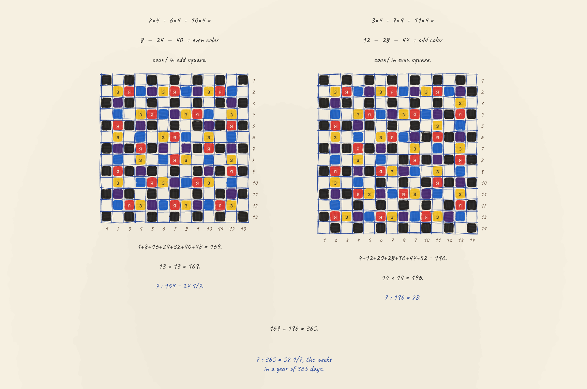

[`examples/jensen.py`](examples/jensen.py) generates a page after Alfred
Jensen's number squares -- rings of colour around a centre, their counts
written around them and computed from the same rings -- and paints it with the
sketch theme's `gouache` fill.

### Operators and words

```python
m.add("sum", inputs=[a, b])              # a circle with a plus in it
m.multiply("gate", inputs=[value, gate]) # a circle with a times sign
m.op("pe", "~")                          # a sine: a positional encoding
m.op("z", "Σ", inputs=[mu, sigma])      # any other symbol, set as text
m.text("in", "Inputs")                   # words an arrow can start or end at
```

Each value arriving at an operator gets its own arrow into the circle, on the
side that faces where the value comes from. Three or more values from one
direction join on a bus and enter as one arrow. The symbols `+`, `x`, `-`, `.`
and `~` are drawn as strokes, so they sit exactly in the centre in any
typeface.

A value that enters an operator from the side -- a position embedding added to
a stream of tokens -- goes in a row with the operator. The row is aligned on
the operator, so the stream stays straight:

```python
with m.row("pe") as row:
    pos = row.text("pos", "Position embedding")
    total = row.add("sum", inputs=[projection, pos])
```

### Math in labels

Text between dollar signs is math, in a small subset of TeX:

```python
m.text("c", "$c_{t-1}$")               # subscript: one character, or {a group}
m.block("attn", label="softmax($QK^T$)V")
m.text("eps", r"$\epsilon \sim N(0, I)$")
m.text("out", r"$\hat{x}$")            # \hat, \bar, \tilde, \dot
m.text("h", r"$\vec{h}_1$")            # \vec, \overrightarrow, \overleftarrow
m.block("w", label=r"$W_{\text{out}}$")  # \text{} and \mathrm{} are upright
```

Latin letters in math are italic and digits are upright, as in TeX. `-` is a
minus sign. `\alpha` to `\omega`, `\Gamma` to `\Omega`, and common operators
and relations (`\times`, `\cdot`, `\sim`, `\in`, `\nabla`, `\to`, `\le`,
`\sum`, ...) become their symbols; `\log`, `\exp`, `\max` and the other named
functions are upright; `\mathcal{L}`, `\mathbb{E}` and `\mathfrak{g}` give
script, blackboard, and fraktur capitals. A superscript and a subscript on one
letter (`$\sigma^2_B$`) are stacked, as in TeX. `\sqrt{d}` is `√d`, and
`\frac{a}{b}` is set inline as `a/b`. `\vec`, `\overrightarrow` and
`\overleftarrow` draw an arrow centred over their whole argument
(`$\overleftarrow{h}$`, the backward state of a bidirectional network); Flexo
draws that arrow itself, because no bundled text face can place one.

Spacing follows TeX. A binary operator or a relation gets one space on each
side, whatever was typed: `$B=0$` and `$B = 0$` both give *B* = 0, and
`$d\times d$` gives *d* × *d*. There is no such space inside a sub- or
superscript (`$\mathbb{R}^{d\times d}$`), or around a sign that opens a formula
or follows `(`, `,` or another operator (`$-y$`). The space that ends a command
name is dropped (`$\alpha x$` is *αx*), and a named function is set apart from
its operand (`$\log p$`). Every other space is kept as typed. Write `\$`
for a literal dollar sign; a single `$` with no closing partner is also
literal. A script cannot contain another script.

A character that the figure's font does not have is set in the next font of the
fallback stack that does; the stack ends in IBM Plex Sans, Liberation Sans, and
Latin Modern Math, which together cover Greek and mathematical symbols. A
character no bundled font has (Chinese, Japanese, Arabic, ...) is taken from an
installed font that has it, and a run of such characters stays in that one
font. Colour emoji fonts are never used, because a figure is drawn from
outlines. A character that no usable font has is an error that names it. An
accent is kept with its letter: if the primary font has the accent but cannot
position it on that letter, the letter and the accent are both set in a
fallback font that can.

### Captions on connectors

`connect(a, b, label="action $A_t$")` puts a caption beside the line, and
`net(..., label=...)` beside a net. A caption names the value its edge carries,
so a captioned edge gets pins of its own and is drawn as its own line, even
next to another edge between the same two ports (unless the side is too short
for a pin each, when the edges share a stem).

Captions are placed after routing. The candidate places are above and below
each horizontal run and on either side of each vertical run, at the middle and
then toward either end; a branch out of a decision tries the places nearest the
decision first, so "yes" and "no" sit by the question. The caption with the
fewest clear places chooses first. A place is clear when it overlaps no
component, title, other caption, or line, and is not within a lane of another
connector, where it would read as that connector's caption. When no place is
clear the cheapest is taken: close beside another line, then outside the
canvas (which then grows), then over a line, then over a box. A caption left
with no clear place takes one from a caption that can move elsewhere.

Room for captions is made before they are placed: a line running over a
captioned edge keeps a caption's height from it, not just a lane, and a grid
leaves a caption's height in the row gap between diagonal neighbours joined by
a captioned edge. A caption that still finds no clear place asks for room --
on the side of its container's contents it sits above or below, or in the gap
between the two children it sits between -- and the figure is laid out again. Lint warns about any caption that overlaps a component, another
caption, or a line (`routing.caption.overlap`, `routing.caption.covers-line`).

### Node-link figures: circles and straight lines

```python
import flexo

with flexo.Figure("mlp", conventions={"lines": "straight"}) as figure:
    with figure.module("m", label="Multilayer perceptron") as m:
        with m.column("in") as column:
            inputs = [column.circle(f"x{i}", f"$x_{i}$", tone="input") for i in (1, 2, 3)]
        with m.column("hidden") as column:
            hidden = [column.circle(f"h{i}", f"$h_{i}$", tone="hidden") for i in (1, 2, 3, 4)]
        m.connect_all(inputs, hidden)
```

`circle` is a labelled circle. All circles in a figure without an authored
`width=` share one size, the size the longest label needs, so a reader does not
compare variables by the length of their names. `shaded=True` fills it grey,
the graphical-model mark for an observed variable. A straight edge is one
segment from outline to outline on the line between the two centres. In a
figure whose convention is straight lines, an edge whose straight line would
run through another component is routed round it instead. An edge made
straight on its own (`shape="straight"`) in a routed figure stays straight
wherever it goes, and lint reports what it crosses as
`routing.obstacle.intersection`. Two straight edges between the same pair run
side by side. Choose straight lines for a whole figure with
`conventions={"lines": "straight"}`, or for one edge with
`connect(a, b, shape="straight")`. `connect_all(sources, targets)` connects
every source to every target.

### Feature maps

```python
image = m.volume("input", (3, 224, 224), label="224×224×3")
conv = m.volume("conv1", (64, 112, 112), label="conv1", input=image, tone="conv")
```

`volume` draws a feature map as a box in oblique projection: the front face
is as tall as the map's height, the box as deep as its width, and as thick as
its channel count, each on a log scale so a whole network fits on a page.
`shape` is `(channels, height, width)`, or `(height, width)` for one channel.
The label is set under the box; arrows attach to the box.

### Flowcharts and architecture diagrams

```python
start = m.terminal("start", label="Start")          # a pill: start or end
data = m.io("data", label="Read batch", input=start)  # a parallelogram: input/output
step = m.block("step", label="Update weights", input=data)
done = m.decision("done", label="Converged?", input=step)  # a diamond
m.connect(done, start, label="no")
```

A process is a `block`, a start or end a `terminal`, a question a `decision`, and
data read or written an `io` parallelogram. The shapes of a software diagram are
components too, each sized round its label and painted in the theme's roles, so a
palette, a tone, or a dark theme recolours them with the rest:

```python
user = m.person("user", "User")                # a head and shoulders, the name under them
web = m.cloud("web", "Internet", input=user)   # a cloud of round puffs
app = m.server("app", "App server", input=web)  # a box over two rack units
cache = m.database("cache", "Cache", input=app)  # a cylinder: a database, any store
jobs = m.queue("jobs", "Jobs", input=app)      # a box whose end is divided into slots
m.document("report", "Nightly report", input=jobs)  # a page with a wavy foot
```

A line meets each of these at its drawn outline, not at the box round it: arrows
into a database from above stop just short of its lid wherever they land on it,
a line leaves an `io` from its slanted side and arrives under a document's wavy
foot, and a straight line ends on a cloud's puffs. A person takes lines at its
shoulders from either side, over its head from above, and under its name from
below. Each draws as plain paths, so the editable SVG, the PDF, and a slide's
PowerPoint keep them as shapes.

A line meets a circle or a diamond only at the middle of a side of its box,
which for a diamond is a corner. Each line gets a corner of its own while
corners last. A line in line with the diamond chooses first, then the line to
the nearest neighbour, so the flow keeps its corners: the "no" of a loop leaves
by a side corner, not by the top corner its input came in by, and a loop back
from far down the chart comes in by a corner the flow does not use.

### Line styles and arrowheads

```python
m.connect(x, z, line="dashed")                  # or "dotted"
m.connect(top, bottom, arrow="none", label="shared weights")  # undirected
m.connect(a, b, arrow="both")
m.connect(a, b, shape="curved")                 # one smooth curve
m.connect(a, b, width=2, head_size=1.5)         # 2pt wide, heads larger again
```

`line=` changes only the stroke. `arrow=` says where the arrowheads go:
`"end"` (the default, at the target), `"none"` for an undirected link, which
then meets both components, or `"both"`. Nets take `line=` too.

`shape="curved"` draws one smooth curve from the side of the source that faces
the target to the side of the target that faces back. It bows away from the
middle of the figure (round a cycle, outwards), else to the left of its travel,
so two curves between one pair, one each way, bow apart; `via="south"` bows it
that way instead, and `depart=` and `arrive=` sides make it leave and meet those
sides square, as a hand-drawn arrow does. It stays on the canvas, bowing the
other way or less where it would leave it.

`width=` draws a line wider or thinner than the theme's, in points, and its
arrowheads grow and shrink with it, as a drawing program's do; `head_size=`
scales the heads on top of that (`1.5`, half as large again). In the studio
they are a line's **Routing**, **Line Width** and **Arrowhead Size**.

`head=` draws a line's head in a shape of its own: one of the theme's arrow
shapes by name, whatever the theme (`"triangle"`, `"stealth"`, `"latex"`,
`"open"`), or a filled `"dot"`, `"diamond"` or `"square"`; the SBGN heads (above)
say what a line does. With `arrow="both"`, `tail=` gives its start a head of
its own (`connect(a, b, arrow="both", head="triangle", tail="dot")`). In the
studio they are **Arrowhead** and **Start Arrowhead**, each shown as it looks.

`connect(a, a)` draws a loop: a recurrent cell's state fed back to itself, a
state that can stay where it is. It goes on the component's emptiest side.

### Layout groups

A `row`, `column`, or `grid` without a label is a layout group
(`role="layout"`): it arranges its children and draws nothing. Give it a
`label` and it is a titled container instead. Layout adds a few rules of its
own:

- A layout group has no padding unless you give it one, so the space between
  its children and its neighbours is exactly its `gap`.
- `layout="flow"` (top to bottom) or `layout="flow-right"` (left to right)
  arranges a group's children from their wiring, so they can be written flat,
  with no rows or columns: each goes one layer after whatever feeds it, and
  each layer is ordered to avoid crossings. A loop back, or a link with no
  arrowhead, does not reorder the layers. `Figure(..., layout="flow")` does
  the same for what sits directly on the figure.
- `layout="cycle"` places a group's children clockwise, in the order written,
  round the border of the squarest grid that holds them: the steps of a
  lifecycle or a metabolic cycle, each beside the next.
- `reverse=True` places a row's or column's children last-first. A stream that
  flows upward is written in the order its values flow -- image, encoder,
  projection -- and drawn from the bottom up.
- Columns side by side that are not wired to each other are parallel branches,
  and are aligned at the top.
- Two rows stacked in a column, with the same number of children and child *i*
  of one wired to child *i* of the other (and to nothing else in the pair),
  are laid out as one grid, so each child sits over its partner. The same holds
  for two columns side by side.
- A figure wider than its page first gets tighter gaps and group padding (down
  to half), and only then a wider page, with a `layout.width.grown` warning.
  A figure compiled with an explicit `style=` keeps its spacing exactly.

### Laying a figure out for a box (slides, posters)

A figure is written for a page, which is taller than it is wide. To place one
in a box of another shape -- a 16:9 slide, a poster panel -- let flexo lay it out
for that box rather than shrinking the page layout into it:

```python
fit = flexo.fit_in_box(figure, 864, 380, words=13, largest=20)   # points
fit.layout      # "as written", "turned", "turned within", each maybe ", tighter"
fit.words       # the size its words are drawn at in the box
fit.compilation, fit.scale, fit.ink              # what to draw, and where
```

It compiles the figure where its words are `words` points once drawn, measures
its ink, and tries it as written, **turned** (`flexo.turned(spec)`: rows become
columns, a stack that reads upward reads left to right, grids transpose, ports
and hints turn with it, vector glyphs lie down), and with tighter spacing --
keeping the most natural layout whose words come within 12% of the largest.
When none sets the words at their size, long rows and columns are **folded**
onto two lines (`flexo.orient.wrapped`) -- if that sets them at least 30% larger,
since a fold changes how the figure reads.
Measured sizes rank the candidates, so only layouts that could win are routed.
[flexo-talk](https://github.com/jamaliki/flexo-talk) lays every slide figure out
this way.

## Themes, palettes, and fonts

A **theme** is one name for a whole look -- typeface, line weights, corners,
arrowheads, how a module draws its boundary, and the rules that turn colours
into paint. A **palette** is the colours. They compose: every theme takes every
palette.

```python
flexo.Figure("f", theme="paper")                               # the default
flexo.Figure("f", theme="tikz")                                # a LaTeX/TikZ figure
flexo.Figure("f", theme="dark", background=True)               # slides, on navy
flexo.Figure("f", theme="swiss", font="Helvetica")             # any installed font
flexo.Figure("f", palette=["#2a6f97", "#e76f51", "#2a9d8f"])   # your own colours
```

| Theme | Look |
| --- | --- |
| `paper` | Journal default: Figtree, pastel boxes with same-hue outlines, Stealth arrows |
| `tikz` | A TikZ figure in a LaTeX paper: Latin Modern, hairlines, 10% tints, dashed module boxes |
| `slides`, `dark` | Projection scale: 12 pt type, heavier lines, 16:9 widths; `dark` on navy |
| `archive` | A 1970s technical report: cream page, Helvetica, hairlines, one accent, greys |
| `print` | Bertin: ink only, kinds told apart by lightness, never by hue |
| `swiss` | International Typographic Style: red and black, section rules instead of boxes |
| `bauhaus` | Primary colours as solid fills, heavy outlines, capitals |
| `midcentury` | Brick, teal and mustard on warm paper, hard offset shadows |
| `sketch` | Drawn by hand: wandering ink lines, watercolour washes on cream paper, Kalam lettering |
| `rams`, `economist` | Quiet greys and one signal colour; a news graphic with red section bands |
| `classic` | Flexo's original look, kept exactly |

Every figure's SVG is **transparent**: the theme's page colour is used to
choose fills and contrast, but the page itself is left unpainted, so the figure
sits on whatever it is placed on. `Figure(background=True)` paints the theme's
page colour (the cream of `archive` or `sketch`, the navy of `dark`), and
`background="#ffffff"` paints any colour.

The themes follow the modes of [labviz](https://github.com/jamaliki/labviz), and
the palettes are design-corner's, the same ones labviz plots with, so a diagram
and the plots beside it read as one figure. `flexo themes` lists them all;
`flexo build figure.yaml --theme tikz --palette "Deep Sea Harvest"` overrides a
figure's own choice from the command line.

### Your own theme, in a file

A look of your own -- a lab's, a journal's -- is a YAML file that starts from
any theme and changes what it likes:

```yaml
theme:
  name: lab
  base: paper
  font: Helvetica
  type: {size: 7.5pt}
  palette: ["#1d4e89", "#f26419", "#2a9d8f"]
  style: {corner_radius: 1.5pt, arrow_shape: latex}
  conventions: {branch: dot}
palettes:
  Lab warm: ["#9b2226", "#ca6702", "#ee9b00"]
```

A theme set in faces Flexo does not ship brings them with `fonts: [fonts/]`
beside `theme:` (files or folders, found from the theme file), and its palette
is used in the order written: the first colour is the accent.

`Figure(theme="lab.yaml")` uses it (so does `theme: lab.yaml` in a figure file,
and `flexo build ... --theme lab.yaml`), `flexo.register_theme("lab.yaml")`
makes it `theme="lab"`, and a directory named by `FLEXO_THEME_PATH` makes every
theme and palette in it available everywhere. `uv run flexo theme paper -o
lab.yaml` writes out every setting a theme has, as a file to start from.
Palettes can be registered on their own: `flexo.register_palette("Lab",
["#..", ...])`, or a file of `palettes:`. A setting a theme does not have is
refused with the nearest one it does (`extends:` → `base:`), never ignored.
Right-to-left text (Persian, Arabic, Hebrew) is ordered by Unicode's bidirectional
algorithm (`flexo.bidi`), English words and formulae inside it included, and set
in one face per script (Vazirmatn, Noto Sans Arabic, or Geeza Pro, whichever is
installed first).
`[words]{accent}` paints words in a colour (`accent2`..., `muted`, a palette role, or
`#rrggbb`). `[words](https://...)` in a label is a link -- clickable in the SVG, the PDF, and
flexo-talk's PowerPoint -- set in the accent colour.
Code between backticks in a label (`` `fit()` ``) is set in `type: {mono_family: ...}`,
or the first installed of JetBrains Mono, Menlo, Consolas, DejaVu Sans Mono, ....
`type: {math_family: Latin Modern Math}` sets maths symbols and italic Greek
in a maths font, as TeX does (the `tikz` theme does this). The
[tutorial](docs/tutorial.md#12-your-own-theme-and-palette) lists every key.

### Drawing by hand

`theme="sketch"` draws a figure the way an illustrator would, after
[mol-sketch](https://github.com/jamaliki/mol-sketch): every line in two
wandering strokes, every box coloured in with a watercolour wash, on cream paper,
lettered in Kalam. Any other theme can be drawn by hand too, keeping its own
type and colours:

```python
flexo.Figure("f", theme="sketch")                                  # the illustrated look
flexo.Figure("f", theme="paper", sketch=True)                      # paper, drawn by hand
flexo.Figure("f", theme="sketch", sketch={"fill": "hatch"})        # pencil hatching
flexo.Figure("f", theme="sketch", sketch={"fill": "gouache"})      # opaque paint, brushed
flexo.Figure("f", theme="sketch", sketch={"roughness": 0.2})       # a careful hand
```

The drawing is done after layout, so a sketched figure has exactly the clean
figure's geometry: boxes stay where they were, arrows still end on them, text
stays live and editable. Each line is seeded from its element's id, so a figure
draws the same way every time. The settings (`flexo.Sketch`) are:

| Setting | Default | Meaning |
| --- | --- | --- |
| `roughness` | `0.5` | How loose the hand is: 0 is a ruled line, 1 a quick sketch |
| `passes` | `2` | Strokes per line: the line, then lighter strokes going back over it |
| `fill` | `"wash"` | `"wash"` (watercolour), `"hatch"` (pencil lines), `"solid"`, `"gouache"` (opaque paint with the brush's streaks and uneven density), or `"none"` |
| `paper` | `true` | A few faint stains over the page, as on worked paper |
| `seed` | `0` | Another number draws the same figure with a different hand |

In YAML the same settings go under `sketch:` on the figure (`sketch: true`
for the default hand).

**Fonts** resolve by family name, and whatever Flexo measures with is what the
SVG, the PDF and the PNG are drawn in. IBM Plex Sans, Figtree, Liberation Sans
(metric-compatible with Arial and Helvetica), Latin Modern Roman, Latin
Modern Math, and the handwriting faces Kalam and Caveat (Latin only) ship with
Flexo and work everywhere; any installed family works by
name, and `flexo.register_font("path/to/Face.ttf")` (or `FLEXO_FONT_PATH`) adds
a file. Characters a family lacks -- Greek in Figtree, say -- fall back to the
next family that has them, measured in the face that will draw them. Bundled
faces are embedded in the SVG, cut down to the characters the figure uses, so
an editable SVG is tens of kilobytes rather than a megabyte and a half; the PDF
embeds its own subsets and the portable SVG and PNG draw the glyphs' outlines,
so no output ever falls back to a substitute face.

### Colour by kind

Each kind of component takes a colour of its own -- the next palette colour for
each kind a figure uses -- so every attention block is one colour, every
add-norm another, and they match wherever they appear. A plain `block` is
neutral until you give it a tone:

```python
tower.block("ff", label="Feed Forward", tone="ffn")   # every "ffn" block matches
tower.block("lin", label="Linear", tone=3)            # the palette's third colour
tower.attention("mha", tone="neutral")                # take a kind's colour away
```

Tones are paint roles (`tone-1-fill`, `tone-1-stroke`, ...), so `flexo retheme`
recolours a finished SVG without touching its geometry.

**Badges** mark what is frozen, trained, or fine-tuned, as papers do: a small
snowflake, flame, or lightning bolt drawn on the box's top-right corner.

```python
m.block("encoder", label="Vision encoder", badge="frozen")    # a snowflake
m.block("projection", label="Projection", badge="trained")    # a flame
m.block("llm", label="Language model", badge="tuned")         # a lightning bolt
m.legend(badges={"frozen": "frozen", "trained": "trained", "tuned": "fine-tuned"})
```

The marks are vector paths, not emoji, so they look the same in every
renderer, in print, and drawn by hand in the `sketch` theme.

`m.legend()` keys the colours: a swatch and a name for every tone the
components created so far are painted in. Pass `entries={"encoder": "Encoder
blocks", ...}` to choose the tones and their words, and `layout="column"` to
stack the entries.

## Conventions: branches, merges, arrivals, lines, and pins

Papers draw lines by different conventions, and Flexo lets a figure choose.
Lines meet in three ways; the defaults are:

- **Branch.** A value read by several components is drawn as one tree that
  forks with a plain T. There is no dot.
- **Merge.** Where two lines join into one (`merge(...)`), the joining line
  ends in an arrowhead that points into the line it joins. A merge of three or
  more lines is a bus: the lines meet it with plain Ts, and the only arrowhead
  is the one into the destination.
- **Arrivals.** Several connectors that end at the same port each get their
  own arrow, spread along the side of the box. They are not joined.

If the lines combine by an operation, author the operation with `add`,
`multiply` or `op`. It is then drawn as a circle, and the arrows point into
it. A fourth convention, `lines`, chooses between routed right-angled lines
(the default) and straight ones. A fifth, `pin_spread`, sets where arrows meet
a side: the central `pin_spread` of the side (0.8 by default) is cut into
equal shares, one per arrow, and each arrow meets the side at the middle of its
share. One arrow meets the middle of the side; two meet it at 30% and 70%. An
arrow still moves off its place when that lets it run straight to the box it
faces.

Change a convention for a whole figure with `conventions=`, or in YAML with a
`conventions:` mapping on the figure:

```python
flexo.Figure("f", conventions={"branch": "dot"})     # a dot on every fork
flexo.Figure("f", conventions={"merge": "plain"})    # no arrowheads at joins
flexo.Figure("f", conventions={"arrivals": "joined"})  # join before the port
flexo.Figure("f", conventions={"lines": "straight"})     # diagonals, not routes
flexo.Figure("f", conventions={"pin_spread": 0.5})       # arrows nearer the middle
```

| Convention | Values (default first) |
| --- | --- |
| `branch` | `"plain"`, `"dot"` |
| `merge` | `"auto"`, `"arrow"`, `"plain"`, `"dot"` |
| `arrivals` | `"separate"`, `"joined"` |
| `lines` | `"orthogonal"`, `"straight"` |
| `pin_spread` | `0.8`, or any number from 0 to 1 |

A theme can carry its own conventions (`LayoutStyle.conventions`). A net's
`joint="arrow"` or `joint="dot"` overrides the conventions for that one net.

## How connectors are routed

Routing follows the routers that draw connectors well (libavoid, ELK, yFiles).
It never fails for lack of a path: if a figure is too tight for its
connectors, it is laid out again with the room they need. A hint that cannot
be honoured is reported as a warning, not an error. (A `lane=` or waypoint
that names nothing in the figure is still an error.)

The steps -- pins, search, rip-up and reroute, separation, uncrossing, and
room -- and the hints that steer them (`via=`, `rail=`, `rail_at=`, `lane=`) are
described in [docs/routing.md](docs/routing.md).

## Documentation

- [Tutorial](docs/tutorial.md): figures step by step, from a first box to a
  themed, hand-drawn panel, and a table of where each choice lives.
- [SKILL.md](SKILL.md): the whole of it on one page -- the loop, the calls, the
  habits that make figures read well -- for a person or an assistant.
- [Authoring guide](docs/guide.md): every component, grids and alignment,
  vector glyphs, band rows, paint and retheming, artwork, shadows, export
  formats, and which palette role paints what.
- [Routing](docs/routing.md): how connectors are routed, and nets, rails, and `via=`.
- [Architecture](docs/architecture.md): the compiler's passes and modules.
- [Examples](examples/README.md): the scripts in `examples/` and what each shows.

## Command line

```bash
uv run flexo build examples/vertical_slice.yaml --output examples/build
uv run flexo build examples/vertical_slice.yaml --theme tikz --palette "Okabe-Ito"
uv run flexo build examples/vertical_slice.yaml --font "Helvetica"
uv run flexo check examples/vertical_slice.yaml
uv run flexo inspect examples/vertical_slice.yaml
uv run flexo gallery --output examples/build
uv run flexo themes                      # themes, palettes, and bundled fonts
uv run flexo retheme build/slice.editable.svg "Deep Sea Harvest" -o build/slice.recoloured.svg
uv run flexo schema
uv run flexo studio                      # edit this folder's figures and themes in the browser
uv run flexo studio mcp                  # the studio's tools for an agent (MCP over stdio)
```

### The studio: edit with people and agents, live

`flexo studio` (in a folder, or on a file) opens an editor in the browser, served
from this machine, for every document in the folder: figures, themes, and --
with flexo-talk -- decks, each in a tab. It is made for working *with* an
agent: what anyone changes -- you, Claude in the studio's side panel, an agent
such as Claude Code working through MCP, or any program writing the files --
is merged with everyone else's edits, saved, and shown at once. Slides and parts
an agent touches flash in its colour, its avatar and what it is doing ("Tightening
slide 4") show where it works, the activity list says who changed what, and
**Follow** keeps the view on whatever an agent is changing. Undo takes back your
own last change and leaves others' alone; the history beside it (⌥⌘Z) lists your
changes in words, to go back or forward to any of them.

- **Figures**, made without writing YAML: **Add** (A) offers every kind of part --
  blocks and operators, the machine-learning components, constructs, plasmids,
  proteins, trees, plates, timelines, structures -- and a part added while another
  is chosen comes after it, a line between them; when the chosen part's single line
  runs on to the part after it, the new one goes into that line, as a step into a
  flow chart. A **+** beside the part chosen adds the next step there at once (a
  block after a start or a decision, another structure after a structure), and the
  words of a part just added are typed on it as soon as it is drawn, in place, in
  the part's own face and size. A chosen structure turns as it is dragged (or by
  the buttons in its panel), and a structure or picture is sized by its corners;
  a shape's **Type** may be made either, its file asked for. Right-click a part
  for what can be done with it. **Connect**
  (C) draws a line from one part to the next; double-click a part or a line to
  type its words on the drawing; ⇧-click several and **Group** (G) gathers them
  into a row, column, grid, or titled module. A part (or a whole group) dragged on the drawing goes to another
  place in its row or column, or into another group: it follows the pointer, a line
  shows where it would go, and once it is let go the figure is laid out again and
  every part slides to where it now is (Esc, or letting go off the figure, takes it
  back). A part dragged out under (or over) a figure laid out in a row goes on a line
  of its own there, centred under the rest -- a score under the steps it compares --
  as **Below** and **Above** in a part's panel do; beside a figure laid out in a
  column, it takes a column of its own. The inspector on the right has each part's settings, down to
  a plasmid's features or a plate's groups as a table; the list on the left holds
  the parts as they nest, dragged to move them. Every edit is made to the figure's
  file, which the **Source** tab shows and edits too: comments and order stay, and
  what the page has no control for can be written there. Lint messages sit under
  the drawing; clicking one chooses the part it is about. flexo-talk edits the
  figures on a deck's slides the same way, where they are drawn.
- **Themes**: a theme's colours (palette, tones, page), type, lines and shapes,
  and spacing, each shown as the base theme has it until changed, with samples
  drawn as you go -- figures, slides, or any deck in the folder.
- **Claude**: ⌘J opens a conversation with Claude that works on the open
  documents, told what you are looking at. It needs `pip install 'flexo[assistant]'`
  and credentials the Anthropic SDK finds (`ANTHROPIC_API_KEY`, or `ant auth login`).
- **Agents**: `claude mcp add flexo-studio -- flexo studio mcp` (once, in the
  folder) gives Claude Code the studio's tools: list, open, read, and edit
  documents (as their YAML), *look* at pages as pictures with their warnings,
  see what you are looking at, and say what it is doing. It joins the studio open
  on the folder, or starts one. Any MCP client can run `flexo studio mcp` the same way.
- **Shared folders**: a folder kept by Dropbox, Google Drive, iCloud Drive,
  OneDrive or Box can be open in studios on several computers at once. Each
  studio takes in what the others save as the service brings it, merged with
  what is being typed there. When two computers save a file at once, the copy
  the service keeps beside it ("talk (Ben's conflicted copy).yaml", "talk
  [Conflict].yaml") is merged back in and moved out of the folder, to
  `~/Library/Application Support/flexo/merged`. In such a folder a document is
  saved after 1.5 s without typing (at most every 8 s), not 0.35 s, so the
  service carries fewer versions and two computers save at once less often.
- ⌘K searches every command, slide, and file; `?` lists the keys.

Other packages add kinds of document through the `flexo.studio` entry-point
group (`flexo.studio.Kind` says what one provides) and samples for the theme
editor through `flexo.studio.specimens`. The studio reads and writes only inside
its folder, answers on `127.0.0.1` alone, and needs the token its page is given
(agents find it in a session file only its owner can read). A document that names
Python -- a deck's plots -- runs it when drawn.

The builder lowers to the same validated, versioned schema that YAML and JSON
parse into, so a figure is one thing written two ways -- see
[`examples/vertical_slice.py`](examples/vertical_slice.py) and its
[YAML equivalent](examples/vertical_slice.yaml). A figure's `style` (or
`theme`), `palette`, `font`, `conventions` and `sketch` are fields of that
document too. A hand-written file may be short: nodes are blocks unless they
say otherwise, `from: encoder` means the node's output (and `to:` its input),
edges are numbered for you, and a file with no `groups` stacks its nodes in a
column (see [the tutorial](docs/tutorial.md#13-the-same-figure-as-a-file)).

`build` and `gallery` always write their outputs so a flawed figure stays
inspectable: lint diagnostics go to stderr and the command exits `1` when any of
them is an error. Only a hard compile failure (exit `2`) produces no output.

## Development

```bash
uv sync --all-groups
uv run pytest
uv run ruff check
uv run flexo --help
```

See [the architecture](docs/architecture.md). The
[implementation report](docs/implementation-report.md) and
[improvement beam](docs/improvement-beam.md) are the history of the first
version.

## Design principles

- semantic authoring instead of routine SVG coordinates;
- immutable, deterministic compiler passes;
- physical publication dimensions and measured typography;
- stable semantic IDs, named ports, and localized diagnostics;
- connectors routed as a whole, never failing: pins on the facing side, trees for
  shared values, crossings priced, lanes solved, and room asked of the layout;
- first-class fan-out nets and merges: branches are plain Ts, a merge of two ends
  in an arrow, and an operation is an operator node;
- defaults that read the figure they are in, and authored values that always win;
- orthogonal routing with a theme-controlled local elbow radius, and straight
  lines where a figure asks for them;
- themes that change the whole look -- type, line work, colour rules -- and move
  nothing a reader relies on;
- connector ink painted after the components it joins, so no run is interrupted
  by a container fill;
- native SVG primitives, live text, and named Inkscape layers;
- explicit editorial layout with bounded local automation;
- linting that reads the finished figure and never feeds back into it.

## License

Flexo is licensed under the [Apache License 2.0](LICENSE). The fonts in
`src/flexo/resources/fonts` keep their own licenses, which sit beside them: the SIL
Open Font License for Caveat, Figtree, IBM Plex Sans and Kalam, the GUST Font License
for Latin Modern, and Liberation's license for Liberation Sans.
