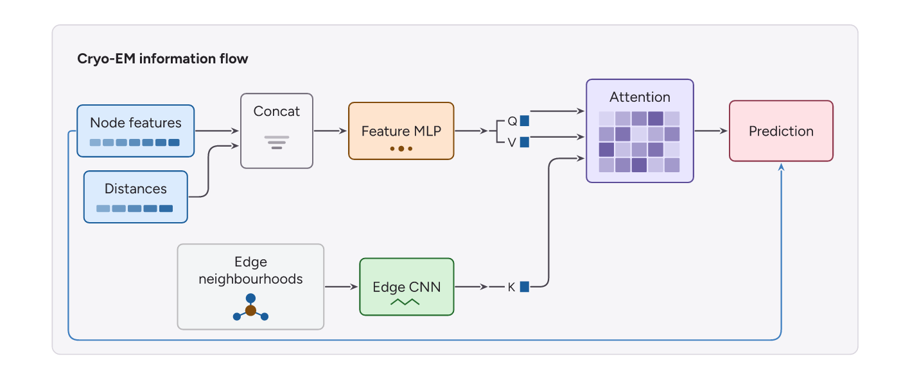
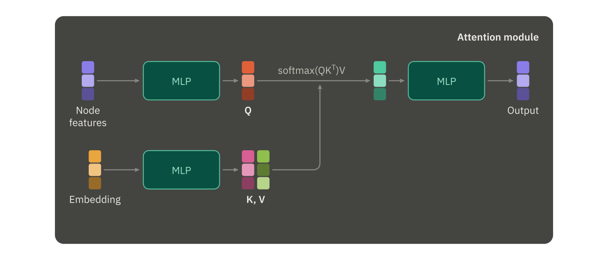
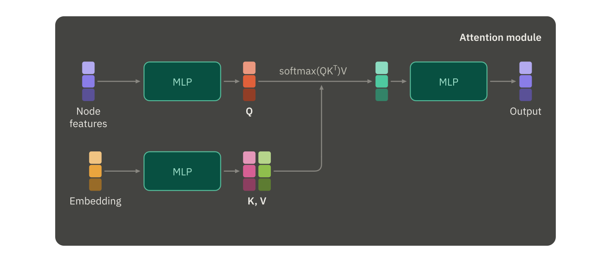
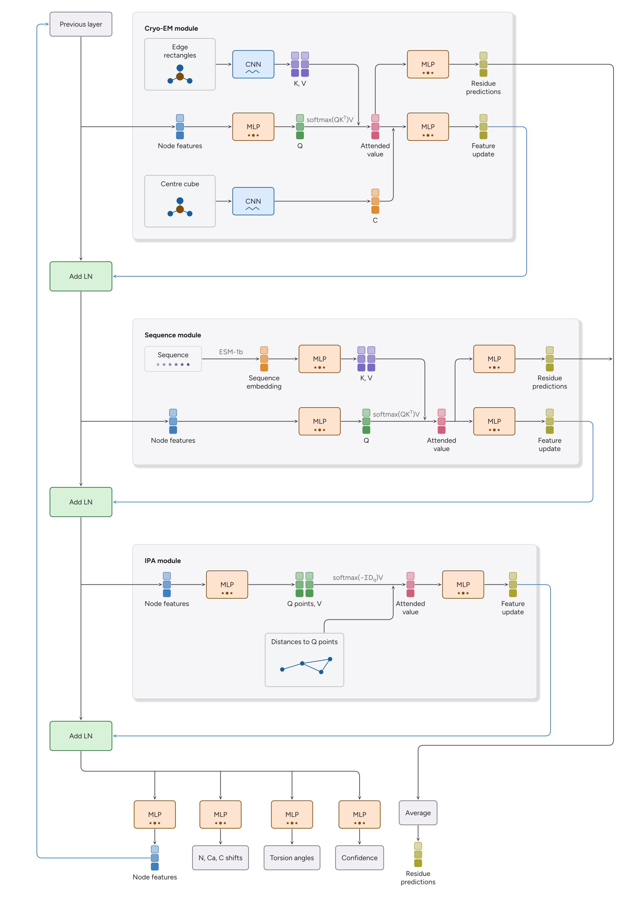
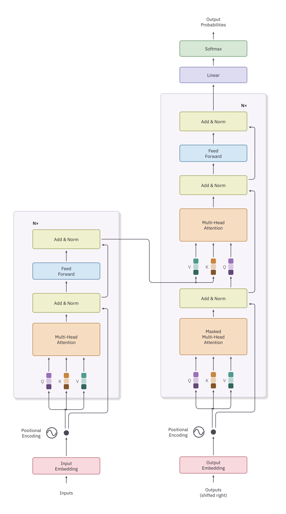

# Examples

Each script runs from the repository root and writes an editable SVG and a
preview PNG into `build/`:

```bash
uv run python examples/vertical_slice.py
uv run python examples/attention_module.py
uv run python examples/modelangelo_gnn.py
```

## [`vertical_slice.py`](vertical_slice.py)

The acceptance figure, plus [`vertical_slice.yaml`](vertical_slice.yaml) — the
same figure as interchange, to show that the Python builder and the YAML schema
are one thing.

[](build/vertical-slice.preview.png)

## [`attention_module.py`](attention_module.py)

A dark attention panel from palette overrides alone: `VectorPreset` glyphs, a
reserved grid lane holding the attention corridor open, and `rail_at`/`joint`
placing the merge. Its presets name no `order`, so every glyph takes the
default — shades permuted per column, reading as a feature vector.

[](build/attention-module.preview.png)

The same panel with `order="ramp"` — every colour kept, run light-to-dark
instead, so each glyph reads as a gradient. A ramp claims the cells are
*ordered*, which is why it is asked for by name rather than defaulted to.

[](build/attention-module-ramp.preview.png)

## [`modelangelo_gnn.py`](modelangelo_gnn.py)

The ModelAngelo GNN panel: band rows on a shared spine, three port-aligned module
grids, and a five-head readout that recycles into the top. Authored in
[`flexo/gallery.py`](../src/flexo/gallery.py).

[](build/modelangelo-gnn.preview.png)

## transformer.py

The Transformer from "Attention Is All You Need" (Vaswani et al. 2017): two
towers authored bottom-up, residual skips on the add-norm `branch`/`skip`
ports — all five bowing out to the east, because those two ports are pinned
there so a bypass reads the same way in both towers — Q/K/V triples as one
`fan_out` each, and hand-drawn positional-encoding glyphs embedded with
`image()`.


